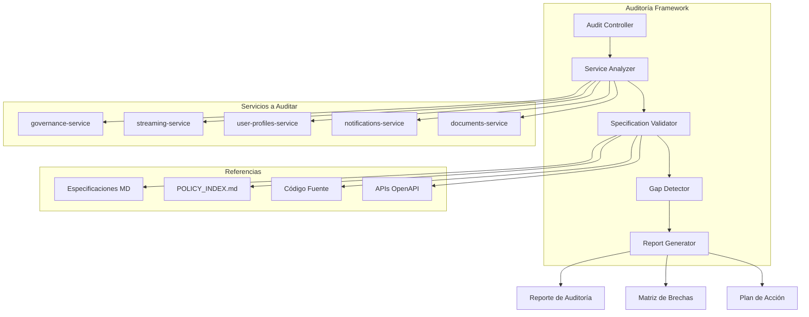

# Documento de Diseño - Auditoría y Validación de Servicios SmartEdify

## Visión General

Este documento define el diseño para realizar una auditoría completa y sistemática de los servicios principales de SmartEdify. La auditoría evaluará el estado actual de implementación contra las especificaciones técnicas de referencia, identificará brechas y generará recomendaciones priorizadas para cada servicio.

## Arquitectura de la Auditoría

### Componentes Principales

### Metodología de Auditoría

#### 1. Análisis de Especificaciones
- **Entrada**: Archivos de referencia en `/referencias/`
- **Proceso**: Parseo y extracción de requisitos técnicos
- **Salida**: Matriz de requisitos por servicio

#### 2. Análisis de Implementación
- **Entrada**: Código fuente en `/smartedify_app/services/`
- **Proceso**: Análisis estático de estructura, APIs y funcionalidades
- **Salida**: Estado actual de implementación

#### 3. Validación Cruzada
- **Entrada**: Especificaciones vs Implementación
- **Proceso**: Comparación sistemática y detección de brechas
- **Salida**: Lista de discrepancias y elementos faltantes

#### 4. Generación de Reportes
- **Entrada**: Resultados de validación
- **Proceso**: Consolidación y priorización
- **Salida**: Reportes ejecutivos y técnicos

## Criterios de Evaluación

### Dimensiones de Auditoría

| Dimensión | Peso | Criterios de Evaluación |
|-----------|------|------------------------|
| **Funcionalidad** | 30% | Endpoints implementados, lógica de negocio, flujos completos |
| **Arquitectura** | 25% | Patrones implementados, separación de responsabilidades, integraciones |
| **Seguridad** | 20% | Autenticación, autorización, RLS, cifrado |
| **Calidad** | 15% | Tests, documentación, observabilidad |
| **Operación** | 10% | Deployment, configuración, health checks |

### Escala de Evaluación

- **100%**: Completamente implementado según especificación
- **75-99%**: Mayormente implementado con gaps menores
- **50-74%**: Parcialmente implementado con gaps significativos
- **25-49%**: Implementación básica con funcionalidad limitada
- **0-24%**: No implementado o solo estructura básica

## Análisis por Servicio

### 1. Governance Service (Puerto 3011)

#### Estado Esperado (según especificación)
- **Gestión completa de asambleas** híbridas (presencial/virtual/mixta/asíncrona)
- **Flujos de iniciativa y convocatoria** con validación legal
- **Votación ponderada** por alícuotas con múltiples métodos
- **Integración con compliance-service** para validación de políticas
- **Generación de actas con IA** (MCP) y firma digital
- **Auditoría inmutable** con event sourcing y sellos criptográficos

#### Análisis de Implementación
- **Estructura**: ✅ NestJS completo con módulos organizados
- **Base de datos**: ✅ PostgreSQL con RLS implementado
- **APIs**: ✅ Endpoints REST completos y documentados
- **Integraciones**: 🔄 Parciales (streaming ✅, compliance 🚧, documents ❌)
- **Event Sourcing**: ✅ Kafka implementado
- **Observabilidad**: ✅ Métricas, logs y trazas

#### Brechas Identificadas
- **documents-service**: Integración faltante para generación de actas
- **compliance-service**: Endpoints específicos pendientes
- **MCP (IA)**: Implementación del asistente de IA para actas
- **Gamificación**: Sistema de puntos y recompensas

### 2. Streaming Service (Puerto 3014)

#### Estado Esperado (según especificación)
- **Gestión de sesiones de video** con múltiples proveedores
- **Validación de asistencia multi-método** (QR, biometría, SMS, manual)
- **Transcripción en tiempo real** con STT
- **Grabación forense** con sellos criptográficos
- **Moderación híbrida** con WebSocket
- **Delegación completa** al identity-service para validación

#### Análisis de Implementación
- **Estructura**: ✅ NestJS completo con patrones correctos
- **Delegación**: ✅ Correcta al identity-service
- **WebSocket**: ✅ Moderación en tiempo real implementada
- **Grabación**: ✅ S3 cifrado con hash de verificación
- **Transcripción**: ✅ Google STT + Whisper API
- **Multi-tenant**: ✅ RLS activo

#### Brechas Identificadas
- **notifications-service**: Códigos SMS/Email pendientes
- **user-profiles-service**: Lista de propietarios elegibles
- **Optimizaciones**: Cache de validaciones frecuentes

### 3. User Profiles Service (Puerto 3002)

#### Estado Esperado (según especificación)
- **CRUD completo de perfiles** con multi-tenancy
- **Gestión de membresías** (propietario, arrendatario, conviviente)
- **Roles locales y entitlements** modulares
- **Evaluación de permisos** con PDP
- **Consents y DSAR** para privacidad
- **Eventos para sincronización** cross-service

#### Análisis de Implementación
- **Estructura**: ✅ NestJS con módulos principales
- **OpenAPI**: ✅ Contratos completos documentados
- **Configuración**: ✅ Docker/K8s production-ready
- **Observabilidad**: ✅ Métricas y logs configurados
- **Base de datos**: 🚧 Esquema definido, migraciones pendientes
- **Cache Redis**: ❌ Para evaluación de permisos

#### Brechas Identificadas
- **Base de datos**: Ejecutar migraciones y configurar RLS
- **Módulos completos**: Membresías, roles y entitlements
- **Integración PDP**: Con compliance-service
- **Tests**: Cobertura ≥80% pendiente

### 4. Notifications Service (Puerto 3005)

#### Estado Esperado (según especificación)
- **Event Schema Registry** para validación Kafka
- **Notificaciones multi-canal** (email, SMS, push)
- **Códigos de verificación** para validación de asistencia
- **Plantillas multi-idioma** para comunicaciones
- **Muro de noticias virtual** para feed interno

#### Análisis de Implementación
- **Estado**: ❌ 0% implementado - Solo estructura básica
- **Impacto**: 🔥 Crítico - Bloquea streaming y governance
- **Prioridad**: Máxima - Requerido esta semana

#### Brechas Identificadas
- **Implementación completa**: Desde cero
- **Event Schema Registry**: Crítico para Kafka
- **Proveedores**: Email, SMS, push notifications
- **Códigos de verificación**: Para streaming-service

### 5. Documents Service (Puerto 3006)

#### Estado Esperado (según especificación)
- **Generación de actas** con IA (MCP)
- **Almacenamiento S3** cifrado y versionado
- **Plantillas por país** con formatos legales
- **Firma electrónica** para validez legal
- **Adjuntar evidencias** (fotos de papeletas)

#### Análisis de Implementación
- **Estado**: ❌ 0% implementado - Solo estructura básica
- **Impacto**: 🔥 Alto - Requerido para validez legal
- **Prioridad**: Alta - Semanas 3-4

#### Brechas Identificadas
- **Implementación completa**: Desde cero
- **Integración MCP**: Para generación con IA
- **S3 cifrado**: Almacenamiento seguro
- **Firma electrónica**: Integración con proveedores

## Matriz de Consistencia Cross-Service

### Integraciones Validadas

| Servicio Origen | Servicio Destino | Estado | Endpoints Requeridos | Implementado |
|-----------------|------------------|--------|---------------------|--------------|
| governance | streaming | ✅ | POST /sessions, POST /sessions/{id}/end | ✅ |
| governance | compliance | 🚧 | GET /policies/{id}/validate | 🚧 |
| governance | documents | ❌ | POST /documents/generate | ❌ |
| streaming | identity | ✅ | POST /contextual-tokens/validate | ✅ |
| streaming | notifications | ❌ | POST /codes/generate | ❌ |
| user-profiles | compliance | 🚧 | POST /evaluate | 🚧 |

### Eventos Kafka

| Evento | Emisor | Consumidor | Schema Registrado | Estado |
|--------|--------|------------|-------------------|--------|
| assembly.created.v1 | governance | analytics | ❌ | 🚧 |
| session.started.v1 | streaming | governance | ❌ | 🚧 |
| attendance.validated.v1 | streaming | governance | ❌ | 🚧 |
| transcript.chunk.v1 | streaming | governance | ❌ | 🚧 |

## Estrategia de Testing

### Tests de Auditoría

#### 1. Tests de Estructura
- Verificar existencia de archivos clave
- Validar estructura de directorios
- Confirmar configuraciones Docker/K8s

#### 2. Tests de API
- Validar endpoints contra especificación OpenAPI
- Verificar autenticación y autorización
- Confirmar formatos de respuesta

#### 3. Tests de Integración
- Validar comunicación entre servicios
- Verificar eventos Kafka
- Confirmar flujos end-to-end

#### 4. Tests de Seguridad
- Verificar RLS en base de datos
- Validar JWT y DPoP
- Confirmar cifrado de datos

## Herramientas y Tecnologías

### Análisis Estático
- **AST Parsing**: Para análisis de código TypeScript/JavaScript
- **OpenAPI Validator**: Para validación de contratos API
- **SQL Parser**: Para análisis de esquemas de base de datos
- **Docker Inspector**: Para validación de configuraciones

### Generación de Reportes
- **Markdown**: Para reportes técnicos detallados
- **JSON**: Para datos estructurados y métricas
- **HTML**: Para reportes ejecutivos con visualizaciones
- **CSV**: Para matrices de datos y tracking

### Métricas y Visualización
- **Completitud por servicio**: Porcentaje de implementación
- **Matriz de dependencias**: Estado de integraciones
- **Timeline de implementación**: Progreso histórico
- **Priorización de brechas**: Por impacto y esfuerzo

## Entregables

### 1. Reporte Ejecutivo
- **Resumen de estado** por servicio
- **Métricas de completitud** general
- **Recomendaciones priorizadas** por impacto
- **Timeline de implementación** sugerido

### 2. Reporte Técnico Detallado
- **Análisis funcional** por servicio
- **Brechas específicas** con ejemplos de código
- **Matriz de integraciones** con estado actual
- **Recomendaciones técnicas** detalladas

### 3. Plan de Acción
- **Tareas priorizadas** por servicio
- **Estimaciones de esfuerzo** y tiempo
- **Dependencias críticas** identificadas
- **Hitos de entrega** propuestos

### 4. Matriz de Seguimiento
- **Dashboard de progreso** actualizable
- **Métricas de calidad** por servicio
- **Alertas de regresión** automáticas
- **Reportes de tendencias** semanales

## Consideraciones de Implementación

### Automatización
- **Scripts de análisis** reutilizables
- **Pipelines CI/CD** para auditoría continua
- **Alertas automáticas** por cambios críticos
- **Dashboards en tiempo real** para seguimiento

### Escalabilidad
- **Análisis incremental** para servicios grandes
- **Paralelización** de validaciones
- **Cache de resultados** para optimización
- **Modularidad** para nuevos servicios

### Mantenibilidad
- **Configuración externa** para criterios
- **Plantillas reutilizables** para reportes
- **Versionado de especificaciones** para tracking
- **Documentación completa** del proceso

## Riesgos y Mitigaciones

### Riesgos Identificados

| Riesgo | Probabilidad | Impacto | Mitigación |
|--------|--------------|---------|------------|
| Especificaciones desactualizadas | Alta | Medio | Validación con stakeholders |
| Código en constante cambio | Alta | Medio | Snapshots y versionado |
| Dependencias externas | Media | Alto | Mocks y stubs para testing |
| Complejidad de análisis | Media | Medio | Herramientas automatizadas |

### Plan de Contingencia
- **Análisis manual** como fallback
- **Validación por muestreo** si análisis completo falla
- **Reportes parciales** para servicios críticos
- **Escalación temprana** de problemas bloqueantes

## Cronograma de Ejecución

### Fase 1: Preparación (1-2 días)
- Configuración de herramientas de análisis
- Parseo de especificaciones de referencia
- Configuración de acceso a repositorios
- Validación de criterios de auditoría

### Fase 2: Análisis (3-5 días)
- Análisis de cada servicio individualmente
- Validación de integraciones cross-service
- Detección de brechas y inconsistencias
- Generación de métricas de completitud

### Fase 3: Consolidación (2-3 días)
- Generación de reportes detallados
- Priorización de recomendaciones
- Validación con stakeholders técnicos
- Refinamiento de plan de acción

### Fase 4: Entrega (1 día)
- Presentación de resultados
- Entrega de documentación completa
- Configuración de seguimiento continuo
- Transferencia de conocimiento

## Criterios de Éxito

### Métricas de Calidad
- **Cobertura de análisis**: 100% de servicios objetivo
- **Precisión de detección**: >95% de brechas identificadas
- **Utilidad de recomendaciones**: Validada por stakeholders
- **Tiempo de ejecución**: Dentro del cronograma establecido

### Entregables Validados
- **Reportes completos** para todos los servicios
- **Plan de acción** priorizado y estimado
- **Herramientas de seguimiento** configuradas
- **Documentación** completa y actualizada

La auditoría proporcionará una visión clara y accionable del estado actual de SmartEdify, permitiendo tomar decisiones informadas sobre prioridades de desarrollo y asignación de recursos.