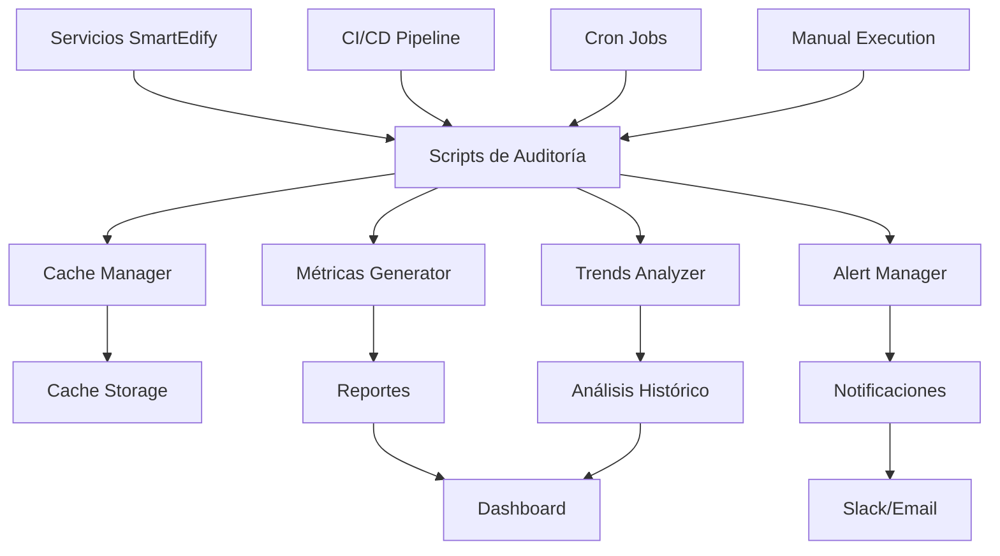
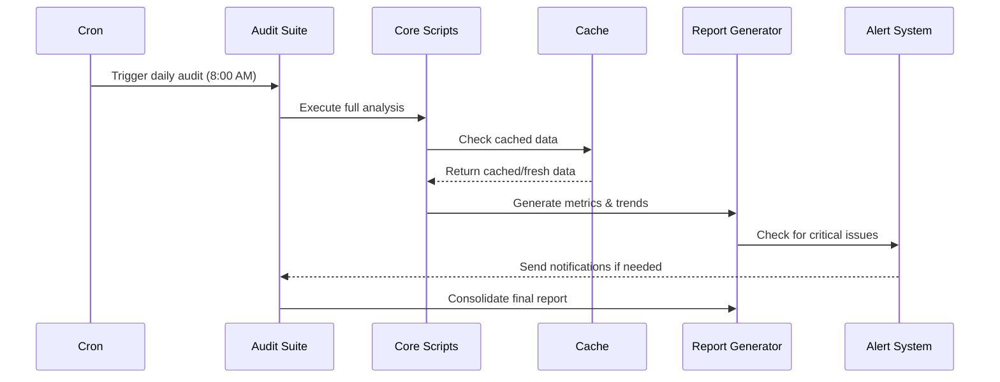
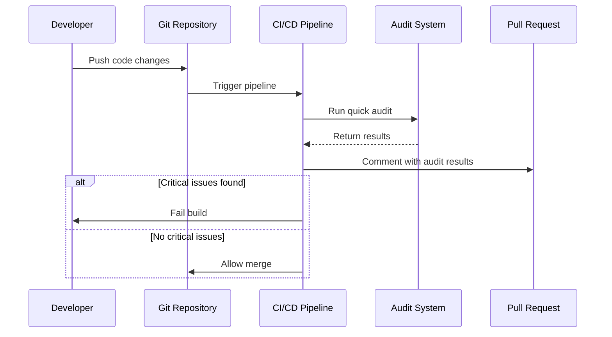
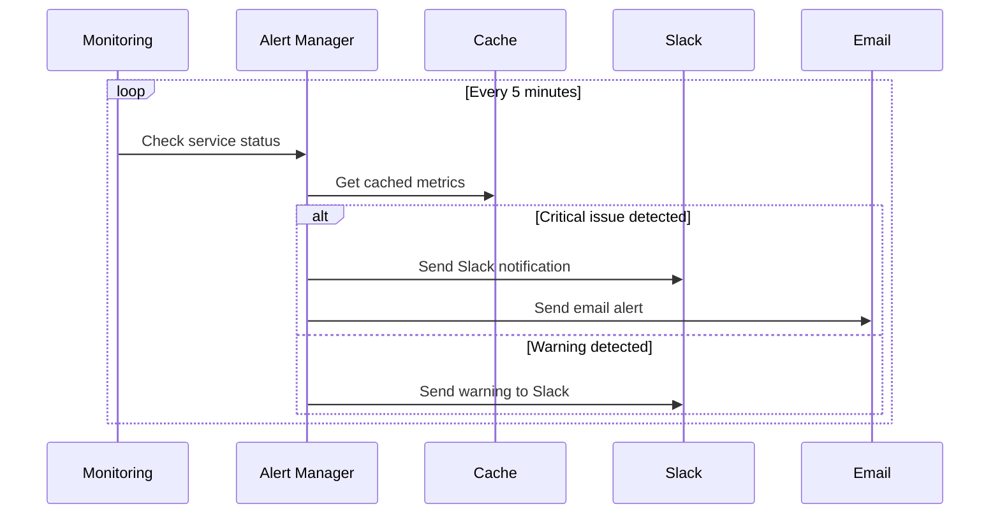

# 📚 Documentación del Proceso de Auditoría SmartEdify

**Versión**: 1.0.0  
**Fecha**: 2025-01-10  
**Estado**: Completado y Operativo  

---

## 🎯 Visión General

El sistema de auditoría SmartEdify es una solución completa para el seguimiento continuo, análisis y reporte del estado de todos los servicios del ecosistema. Proporciona visibilidad en tiempo real, alertas automáticas y proyecciones de progreso para garantizar la calidad y completitud de la plataforma.

## 🏗️ Arquitectura del Sistema



## 📦 Componentes Principales

### 1. Scripts de Auditoría Core

| Script | Propósito | Frecuencia | Salida |
|--------|-----------|------------|--------|
| `generate-metrics.js` | Métricas de completitud y estado | Cada 4 horas | JSON/Markdown |
| `setup-alerts.js` | Alertas automáticas | Cada 5 minutos | Notificaciones |
| `generate-trends.js` | Análisis de tendencias | Diario | Proyecciones |
| `run-audit-suite.js` | Orquestador principal | Variable | Reportes consolidados |

### 2. Herramientas de Soporte

| Herramienta | Función | Beneficio |
|-------------|---------|-----------|
| `cache-manager.js` | Optimización de rendimiento | Reduce tiempo de análisis |
| `setup-audit-environment.js` | Configuración inicial | Automatiza setup |
| `audit-pipeline.yml` | CI/CD Integration | Auditoría continua |

### 3. Configuración y Datos

| Directorio | Contenido | Propósito |
|------------|-----------|-----------|
| `auditoria/scripts/` | Scripts ejecutables | Lógica de auditoría |
| `auditoria/reports/` | Reportes generados | Resultados de análisis |
| `auditoria/history/` | Datos históricos | Análisis de tendencias |
| `auditoria/cache/` | Cache de resultados | Optimización |
| `auditoria/config/` | Configuraciones | Personalización |

## 🔄 Flujos de Trabajo

### Flujo 1: Auditoría Automática Diaria



### Flujo 2: Auditoría en CI/CD



### Flujo 3: Alertas en Tiempo Real



## 📊 Métricas y KPIs

### Métricas Globales

- **Completitud del Ecosistema**: Porcentaje promedio de completitud de todos los servicios
- **Servicios Funcionales**: Número de servicios completamente operativos
- **Alertas Activas**: Número de alertas críticas y de advertencia
- **Tendencia General**: Dirección del progreso (mejorando/estable/declinando)

### Métricas por Servicio

- **Completitud de Funcionalidades**: Porcentaje de funcionalidades implementadas
- **Health Score**: Puntuación de salud (0-100) basada en múltiples factores
- **Tendencia de Progreso**: Tasa de cambio semanal
- **Issues Críticos**: Número de problemas que requieren atención inmediata

### Métricas de Rendimiento del Sistema

- **Hit Rate de Cache**: Eficiencia del sistema de cache
- **Tiempo de Ejecución**: Duración de análisis completos
- **Precisión de Alertas**: Ratio de alertas verdaderas vs falsas

## 🚨 Sistema de Alertas

### Niveles de Alerta

| Nivel | Criterio | Acción | Canal |
|-------|----------|--------|-------|
| **CRITICAL** | Completitud < 50% | Inmediata | Slack + Email |
| **WARNING** | Completitud < 80% | 1 hora | Slack |
| **INFO** | Reportes diarios | Diario | Email |

### Configuración de Notificaciones

```json
{
  "channels": {
    "slack": {
      "webhook": "https://hooks.slack.com/...",
      "channel": "#smartedify-alerts"
    },
    "email": {
      "smtp": "smtp.smartedify.com",
      "recipients": ["dev-team@smartedify.com"]
    }
  },
  "thresholds": {
    "critical": { "completeness": 50 },
    "warning": { "completeness": 80 }
  }
}
```

## 📈 Análisis de Tendencias

### Algoritmos de Proyección

1. **Análisis de Regresión Linear**: Para servicios con progreso constante
2. **Proyección por Fases**: Para servicios en reimplementación activa
3. **Análisis de Confianza**: Basado en variabilidad histórica

### Factores de Proyección

- **Tasa de Progreso Actual**: Cambio porcentual por semana
- **Fases de Implementación**: Duración y progreso esperado por fase
- **Factores Externos**: Dependencias y bloqueos conocidos

## 🔧 Configuración y Personalización

### Variables de Entorno

```bash
# Notificaciones
SLACK_WEBHOOK=https://hooks.slack.com/services/...
SMTP_USER=alerts@smartedify.com
SMTP_PASS=password

# Cache
CACHE_TTL=3600
CACHE_MAX_SIZE=100MB

# Reportes
REPORT_RETENTION_DAYS=30
HISTORY_RETENTION_DAYS=90
```

### Configuración de Servicios

```json
{
  "services": {
    "reservation-service": {
      "priority": "P0",
      "weight": 2.0,
      "thresholds": {
        "critical": 30,
        "warning": 70
      }
    }
  }
}
```

## 🚀 Deployment y Operaciones

### Instalación Inicial

```bash
# 1. Configurar entorno
cd auditoria/scripts
node setup-audit-environment.js --install-deps --setup-cron --configure-ci

# 2. Ejecutar primera auditoría
./quick-start.sh

# 3. Verificar resultados
ls ../reports/
```

### Mantenimiento

| Tarea | Frecuencia | Comando |
|-------|------------|---------|
| Limpieza de cache | Semanal | `node cache-manager.js --action cleanup` |
| Rotación de logs | Diaria | Automática |
| Backup de historial | Mensual | Manual |
| Actualización de configuración | Según necesidad | Manual |

### Monitoreo del Sistema

```bash
# Ver estadísticas de cache
node cache-manager.js --action stats

# Verificar alertas
node setup-alerts.js --test

# Generar reporte de estado
node run-audit-suite.js --mode quick
```

## 🔍 Troubleshooting

### Problemas Comunes

| Problema | Síntoma | Solución |
|----------|---------|----------|
| Cache lleno | Análisis lentos | `node cache-manager.js --action cleanup` |
| Alertas no se envían | Sin notificaciones | Verificar variables de entorno |
| Datos históricos faltantes | Tendencias incorrectas | Ejecutar auditoría completa |
| Scripts fallan | Errores de ejecución | Verificar permisos y dependencias |

### Logs y Debugging

```bash
# Ver logs de auditoría
tail -f auditoria/logs/audit.log

# Ejecutar en modo debug
DEBUG=1 node generate-metrics.js

# Verificar configuración
node setup-audit-environment.js --verify
```

## 📋 Checklist de Operaciones

### Diario
- [ ] Verificar ejecución de auditoría automática
- [ ] Revisar alertas críticas
- [ ] Confirmar generación de reportes

### Semanal
- [ ] Analizar tendencias de progreso
- [ ] Limpiar cache y logs antiguos
- [ ] Revisar configuración de alertas

### Mensual
- [ ] Backup de datos históricos
- [ ] Revisar y actualizar configuración
- [ ] Análisis de rendimiento del sistema
- [ ] Actualizar documentación si es necesario

## 🎯 Roadmap y Mejoras Futuras

### Versión 1.1 (Próxima)
- [ ] Dashboard web interactivo
- [ ] API REST para integración externa
- [ ] Alertas más granulares por equipo
- [ ] Integración con herramientas de monitoreo (Grafana)

### Versión 1.2 (Futuro)
- [ ] Machine Learning para predicciones avanzadas
- [ ] Integración con sistemas de ticketing (Jira)
- [ ] Reportes personalizables por stakeholder
- [ ] Análisis de impacto de cambios

### Versión 2.0 (Visión)
- [ ] Auditoría de código automática
- [ ] Análisis de performance en tiempo real
- [ ] Recomendaciones automáticas de optimización
- [ ] Integración completa con DevOps pipeline

## 📞 Soporte y Contacto

### Equipo Responsable
- **Desarrollo**: Equipo SmartEdify Core
- **Operaciones**: DevOps Team
- **Producto**: Product Management

### Recursos
- **Documentación**: `auditoria/scripts/README.md`
- **Configuración**: `auditoria/config/`
- **Logs**: `auditoria/logs/`
- **Reportes**: `auditoria/reports/`

### Escalación
1. **Nivel 1**: Revisar documentación y logs
2. **Nivel 2**: Contactar equipo de desarrollo
3. **Nivel 3**: Escalación a arquitectura

---

**Documento mantenido por**: Equipo SmartEdify  
**Última actualización**: 2025-01-10  
**Próxima revisión**: 2025-02-10