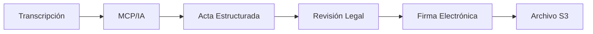

# Resumen Ejecutivo - Análisis Crítico del Documents Service
## SmartEdify Platform - Auditoría de Servicios

### Fecha de Análisis
**Fecha:** 1 de octubre de 2025  
**Versión del Servicio:** 0.1.0  
**Puerto:** 3006  
**Estado General:** ❌ **0% IMPLEMENTADO - IMPACTO LEGAL CRÍTICO**

---

## ⚖️ ALERTA DE VALIDEZ LEGAL

### **COMPLETITUD TOTAL: 0%**

El documents-service es **CRÍTICO PARA LA VALIDEZ LEGAL** de las asambleas. Su ausencia compromete la generación de actas legalmente válidas y la documentación oficial requerida.

---

## 📊 RESULTADOS POR SUBTAREA

### ❌ **Subtarea 6.1: Estado de Implementación para Validez Legal**
**Estado:** NO IMPLEMENTADO (0%)

**Situación Actual:**
- ❌ **Solo estructura básica** - Carpetas y archivos mínimos
- ❌ **Sin funcionalidad** - No hay lógica de negocio implementada
- ❌ **Sin almacenamiento** - S3 no configurado
- ❌ **Sin integraciones** - No conecta con governance-service
- ⚖️ **IMPACTO LEGAL** - Asambleas sin validez legal formal

### ❌ **Subtarea 6.2: Funcionalidades Legales Críticas Faltantes**
**Estado:** COMPLETAMENTE AUSENTE (0%)

**Funcionalidades Requeridas:**
- ❌ **Generación de actas con IA (MCP)** - Desde transcripciones
- ❌ **Almacenamiento S3 cifrado** - Versionado de documentos
- ❌ **Plantillas por país** - Formatos legales específicos
- ❌ **Firma electrónica** - Para Presidente y Secretario
- ❌ **Adjuntar evidencias** - Fotos de papeletas físicas

---

## ⚖️ IMPACTO EN VALIDEZ LEGAL

### **Consecuencias Legales**

#### **Asambleas Sin Validez Formal**
- ❌ **Actas no generadas** automáticamente
- ❌ **Documentación incompleta** para auditorías
- ❌ **Sin firma electrónica** de autoridades
- **Impacto:** Decisiones legalmente cuestionables

#### **Cumplimiento Normativo**
- ❌ **Formatos legales** no estandarizados por país
- ❌ **Evidencias físicas** no digitalizadas
- ❌ **Cadena de custodia** documental incompleta
- **Impacto:** Incumplimiento de normativas locales

#### **Auditoría y Transparencia**
- ❌ **Documentos oficiales** no disponibles
- ❌ **Versionado** de documentos ausente
- ❌ **Acceso controlado** no implementado
- **Impacto:** Transparencia comprometida

---

## 🔗 IMPACTO EN EL ECOSISTEMA

### **Servicios Afectados**

#### **Governance Service (CRÍTICO)**
- ❌ **Generación automática de actas** desde transcripciones
- ❌ **Documentos oficiales** de decisiones
- ❌ **Archivo histórico** de asambleas
- **Impacto:** Proceso manual requerido

#### **Streaming Service (ALTO)**
- ❌ **Conversión de transcripciones** a documentos legales
- ❌ **Evidencias multimedia** no archivadas
- ❌ **Sellos documentales** no generados
- **Impacto:** Transcripciones sin valor legal

#### **User Profiles Service (MEDIO)**
- ❌ **Documentos de membresía** no generados
- ❌ **Certificados de participación** ausentes
- ❌ **Constancias oficiales** no disponibles
- **Impacto:** Documentación de usuarios incompleta

---

## 📋 FUNCIONALIDADES LEGALES CRÍTICAS

### **Generación de Actas con IA**


**Componentes Requeridos:**
- **MCP Integration:** Para procesamiento con IA
- **Plantillas Legales:** Por país y tipo de asamblea
- **Validación Automática:** Estructura y contenido legal
- **Workflow de Aprobación:** Presidente y Secretario

### **Almacenamiento Seguro**
- **S3 Cifrado:** AES-256 para documentos sensibles
- **Versionado:** Control de cambios y auditoría
- **Backup:** Redundancia geográfica
- **Retención:** Políticas según normativas locales

### **Firma Electrónica**
- **Proveedores:** Integración con Llama.pe y similares
- **Certificados:** Validación de identidad
- **Timestamps:** Sellos de tiempo legales
- **Cadena de Custodia:** Trazabilidad completa

---

## 🛠️ ARQUITECTURA RECOMENDADA

### **Stack Tecnológico**
- **Framework:** NestJS (consistencia con otros servicios)
- **Base de datos:** PostgreSQL (metadatos) + S3 (archivos)
- **IA/MCP:** Integración con modelos de lenguaje
- **Firma:** Llama.pe, DocuSign, Adobe Sign

### **Módulos Principales**
```
documents-service/
├── src/
│   ├── generation/         # Generación con IA/MCP
│   ├── templates/          # Plantillas legales
│   ├── storage/           # S3 y versionado
│   ├── signatures/        # Firma electrónica
│   ├── evidence/          # Adjuntos y evidencias
│   └── legal/             # Validación legal
```

### **Integraciones Críticas**
- **governance-service:** Datos de asambleas y decisiones
- **streaming-service:** Transcripciones y grabaciones
- **user-profiles-service:** Datos de firmantes
- **MCP/IA:** Generación inteligente de documentos

---

## 🎯 PLAN DE IMPLEMENTACIÓN LEGAL

### **Fase 1: Funcionalidad Básica (Semana 1)**
1. **Configurar almacenamiento S3**
   - Buckets cifrados por tenant
   - Políticas de acceso y retención
   - Versionado automático

2. **Plantillas legales básicas**
   - Formatos de actas por país
   - Estructura estándar
   - Variables dinámicas

3. **Integración con governance-service**
   - API para recibir datos de asambleas
   - Generación manual de documentos
   - Almacenamiento básico

### **Fase 2: Generación con IA (Semana 2-3)**
1. **Integración MCP**
   - Configuración de modelos de IA
   - Prompts para generación de actas
   - Validación de contenido

2. **Workflow de aprobación**
   - Estados de documento (borrador, revisión, aprobado)
   - Notificaciones a autoridades
   - Historial de cambios

### **Fase 3: Firma Electrónica (Semana 3-4)**
1. **Integración con proveedores**
   - Llama.pe para Perú
   - Configuración por país
   - Certificados digitales

2. **Evidencias y adjuntos**
   - Upload de fotos de papeletas
   - Metadatos de evidencias
   - Validación de integridad

---

## ⚖️ CONSIDERACIONES LEGALES POR PAÍS

### **Perú**
- **Ley de Propiedad Horizontal:** Formatos específicos de actas
- **Firma Electrónica:** Llama.pe como proveedor certificado
- **Retención:** 10 años mínimo para documentos legales
- **Notarización:** Algunos documentos requieren notario

### **Colombia**
- **Ley 675 de 2001:** Régimen de propiedad horizontal
- **Firma Digital:** Proveedores certificados por MinTIC
- **Formatos:** Estructura específica de actas
- **Archivo:** Requisitos de conservación documental

### **México**
- **Ley de Condominios:** Variaciones por estado
- **Firma Electrónica:** FIEL y e.firma
- **Notarización:** Requerimientos notariales
- **Transparencia:** Acceso a documentos por condóminos

---

## 🎯 CONCLUSIÓN EJECUTIVA

El **documents-service** es **CRÍTICO PARA LA VALIDEZ LEGAL** del ecosistema SmartEdify. Sin él, las asambleas carecen de documentación oficial válida.

### **⚖️ IMPACTO LEGAL INMEDIATO**
- **Asambleas sin validez formal** - Decisiones cuestionables
- **Incumplimiento normativo** - Riesgo legal para condominios
- **Documentación incompleta** - Problemas en auditorías

### **⏰ TIMELINE LEGAL**
- **Sin implementación:** Asambleas sin validez legal
- **Implementación básica (2 semanas):** Documentos manuales válidos
- **Implementación completa (4 semanas):** Automatización legal completa

### **💼 RECOMENDACIÓN EJECUTIVA**
**PRIORIDAD ALTA - IMPLEMENTACIÓN URGENTE**
- Equipo con experiencia legal-técnica
- Consultoría legal por país
- Validación con abogados especialistas
- Testing con casos reales

**Calificación General: F (0/100)**
- Funcionalidad: 0/100
- Validez Legal: 0/100
- Arquitectura: 0/100
- Documentación: 0/100
- Integraciones: 0/100

---

**Estado Final:** ⚖️ **CRÍTICO PARA VALIDEZ LEGAL - IMPLEMENTACIÓN URGENTE REQUERIDA**