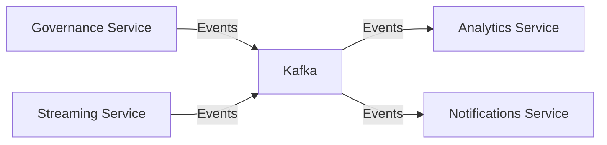
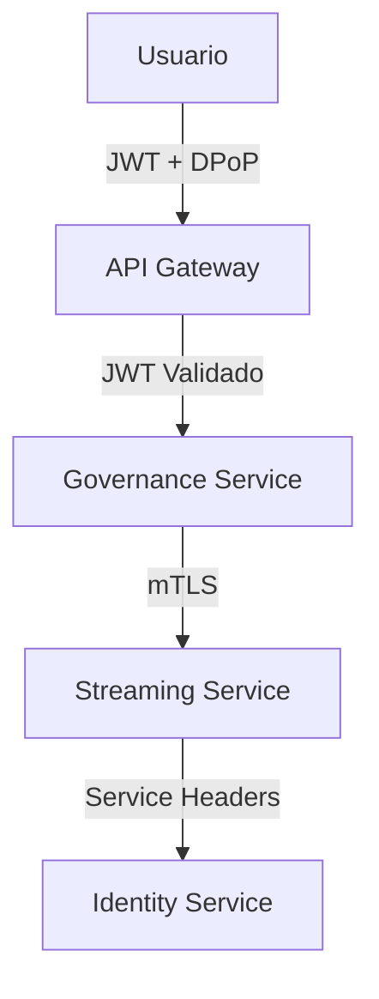
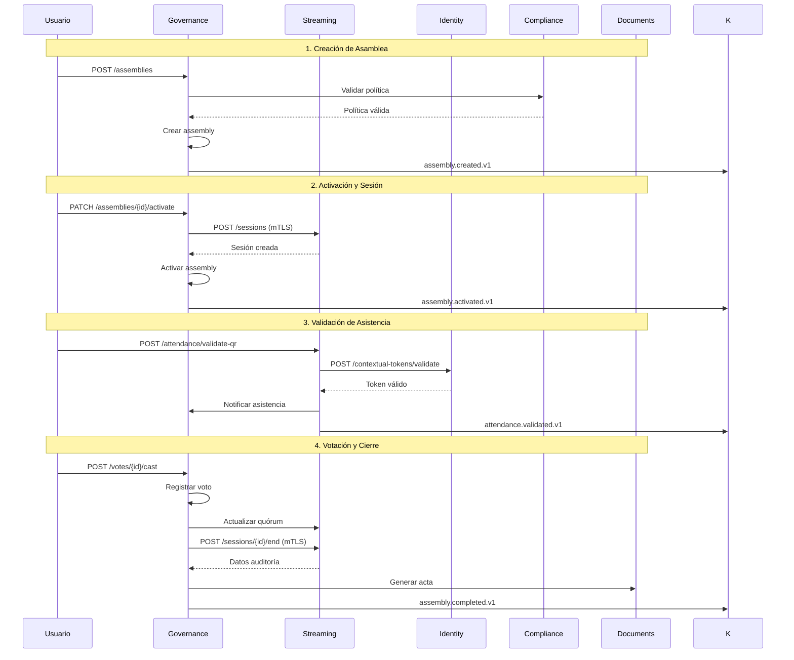
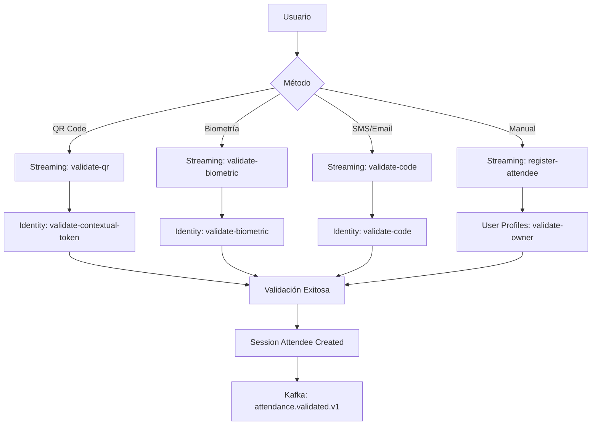

# Arquitectura de Servicios SmartEdify

**Versión**: 2.0  
**Fecha**: 2025-01-01  
**Estado**: ✅ Actualizado con implementaciones  

## Visión General

SmartEdify implementa una arquitectura de microservicios distribuida, organizada en capas funcionales que garantizan escalabilidad, seguridad y mantenibilidad. Cada servicio tiene responsabilidades específicas y se comunica a través de protocolos estándar.

## Estructura de Servicios por Capas

### 🏛️ **Capa de Gobernanza** (`services/governance/`)

#### Governance Service v3.2.2 (Puerto 3011) ✅
- **Responsabilidad**: Orquestación del ciclo de vida de asambleas
- **Estado**: Implementado completamente
- **Tecnologías**: NestJS, PostgreSQL, Kafka, Redis
- **Integraciones**: streaming-service, compliance-service, identity-service

#### Streaming Service v2.2.0 (Puerto 3014) ✅  
- **Responsabilidad**: Gestión de sesiones de video y validación de asistencia
- **Estado**: Implementado completamente
- **Tecnologías**: NestJS, PostgreSQL, Socket.IO, S3, STT APIs
- **Integraciones**: governance-service, identity-service, tenancy-service

#### Compliance Service (Puerto 3012) ⚠️
- **Responsabilidad**: Motor de políticas y cumplimiento normativo
- **Estado**: Pendiente implementación
- **Dependientes**: governance-service (crítico)

#### Reservation Service (Puerto 3013) ⚠️
- **Responsabilidad**: Gestión de reservas de áreas comunes
- **Estado**: Pendiente implementación

### 🔐 **Capa Core** (`services/core/`)

#### Identity Service (Puerto 3001) ⚠️
- **Responsabilidad**: Autenticación, autorización, tokens contextuales
- **Estado**: Estructura básica, pendiente endpoints específicos
- **Dependientes**: streaming-service, governance-service

#### User Profiles Service (Puerto 3002) ⚠️
- **Responsabilidad**: Gestión de perfiles y roles por condominio
- **Estado**: Pendiente implementación
- **Dependientes**: streaming-service

#### Tenancy Service (Puerto 3003) ⚠️
- **Responsabilidad**: Gestión de condominios y límites por tenant
- **Estado**: Pendiente implementación
- **Dependientes**: streaming-service, governance-service

#### Notifications Service (Puerto 3005) ⚠️
- **Responsabilidad**: Notificaciones multi-canal y Event Schema Registry
- **Estado**: Pendiente implementación

#### Documents Service (Puerto 3006) ⚠️
- **Responsabilidad**: Gestión documental y firma electrónica
- **Estado**: Pendiente implementación
- **Dependientes**: governance-service

### 🏢 **Capa de Operaciones** (`services/operations/`)

#### Asset Management Service (Puerto 3010) ⚠️
- **Responsabilidad**: Gestión de activos y mantenimiento
- **Estado**: Implementación parcial disponible

#### Finance Service (Puerto 3007) ⚠️
- **Responsabilidad**: Gestión financiera y cuotas
- **Estado**: Pendiente implementación

#### Physical Security Service (Puerto 3004) ⚠️
- **Responsabilidad**: Control de acceso y CCTV
- **Estado**: Pendiente implementación

### 📊 **Capa de Negocio** (`services/business/`)

#### Analytics Service (Puerto 3016) ⚠️
- **Responsabilidad**: Business Intelligence y Machine Learning
- **Estado**: Pendiente implementación

#### Marketplace Service (Puerto 3015) ⚠️
- **Responsabilidad**: Ecosistema de servicios premium
- **Estado**: Pendiente implementación

---

## Patrones Arquitectónicos Implementados

### 🔄 **Event-Driven Architecture**


**Eventos Implementados**:
- `assembly.*.v1` - Ciclo de vida de asambleas
- `session.*.v1` - Gestión de sesiones de video
- `attendance.*.v1` - Validación de asistencia
- `transcript.*.v1` - Transcripción en tiempo real

### 🛡️ **Multi-Tenancy con RLS**
```sql
-- Implementado en governance-service y streaming-service
ALTER TABLE assemblies ENABLE ROW LEVEL SECURITY;
CREATE POLICY tenant_isolation ON assemblies 
USING (tenant_id = current_setting('app.tenant_id')::uuid);
```

### 🔐 **Seguridad por Capas**


**Niveles de Autenticación**:
- **Usuarios**: JWT + DPoP para operaciones críticas
- **Servicios Internos**: mTLS con certificados SPIFFE
- **Servicios Externos**: Service Headers + JWT

### 📊 **CQRS + Event Sourcing**
```typescript
// Implementado en governance-service
export class AssemblyAggregate {
  // Command side - Write operations
  createAssembly(command: CreateAssemblyCommand): AssemblyCreatedEvent
  activateAssembly(command: ActivateAssemblyCommand): AssemblyActivatedEvent
  
  // Event sourcing - Immutable events
  apply(event: DomainEvent): void
}

// Query side - Read projections
export class AssemblyProjection {
  findAll(filters: AssemblyFilters): Assembly[]
  getStats(tenantId: string): AssemblyStats
}
```

---

## Matriz de Integraciones

| Servicio Origen | Servicio Destino | Protocolo | Autenticación | Estado | SLA |
|-----------------|------------------|-----------|---------------|--------|-----|
| **Governance** | **Streaming** | HTTP/mTLS | mTLS Certs | ✅ | <100ms |
| **Governance** | **Compliance** | HTTP/mTLS | mTLS Certs | ⚠️ | <100ms |
| **Governance** | **Identity** | HTTP/REST | JWT + Headers | ⚠️ | <200ms |
| **Governance** | **Documents** | HTTP/mTLS | mTLS Certs | ⚠️ | <300ms |
| **Streaming** | **Identity** | HTTP/REST | Service Headers | ✅ | <200ms |
| **Streaming** | **Governance** | HTTP/mTLS | mTLS Certs | ✅ | <100ms |
| **Streaming** | **Tenancy** | HTTP/REST | Service Headers | ✅ | <150ms |
| **Streaming** | **User Profiles** | HTTP/REST | Service Headers | ⚠️ | <200ms |

**Leyenda**:
- ✅ Implementado y funcional
- ⚠️ Cliente implementado, pendiente servicio destino
- ❌ No implementado

---

## Flujos de Integración Críticos

### 🏛️ **Flujo: Asamblea Híbrida Completa**


### 🎥 **Flujo: Validación Multi-método**


---

## Observabilidad y Monitoreo

### 📊 **Métricas por Servicio**

#### Governance Service
```typescript
// Métricas de negocio
'assemblies_created_total{tenant,type}'
'assemblies_activated_total{tenant}'
'votes_cast_total{tenant,method}'
'sessions_duration_seconds{tenant}'

// Métricas técnicas  
'http_requests_total{method,endpoint,status}'
'http_request_duration_seconds{method,endpoint}'
'database_connections_active'
'kafka_messages_sent_total{topic}'
```

#### Streaming Service
```typescript
// Métricas de negocio
'sessions_started_total{tenant,modality}'
'attendance_validated_total{method}'
'transcript_chunks_emitted_total'
'recording_duration_seconds_total'

// Métricas técnicas
'websocket_connections_active'
'video_provider_requests_total{provider}'
'transcription_latency_p95_seconds'
'recording_upload_duration_seconds'
```

### 🔍 **Distributed Tracing**
```typescript
// Implementado con OpenTelemetry
const tracer = trace.getTracer('smartedify-services');

// Propagación de trace_id entre servicios
const span = tracer.startSpan('assembly.create');
span.setAttributes({
  'tenant.id': tenantId,
  'assembly.id': assemblyId,
  'user.id': userId
});
```

### 🚨 **Health Checks Distribuidos**
```typescript
// Implementado en ambos servicios
GET /api/v1/health - Estado general + dependencias
GET /api/v1/health/ready - Preparación para tráfico
GET /api/v1/health/live - Liveness probe

// Respuesta con dependencias
{
  "status": "healthy",
  "dependencies": {
    "database": "healthy",
    "kafka": "healthy", 
    "redis": "healthy",
    "identity-service": "degraded",
    "compliance-service": "unavailable"
  }
}
```

---

## Roadmap de Implementación

### 🎯 **Sprint Actual (Enero 2025)**
- [x] Governance Service v3.2.2 - Completado
- [x] Streaming Service v2.2.0 - Completado  
- [x] Integración bidireccional - Completado
- [ ] Identity Service endpoints específicos
- [ ] Compliance Service MVP

### 🚀 **Próximo Sprint (Febrero 2025)**
- [ ] Tenancy Service completo
- [ ] User Profiles Service
- [ ] Documents Service MVP
- [ ] Notifications Service básico

### 📈 **Q1 2025**
- [ ] Asset Management Service
- [ ] Finance Service
- [ ] Physical Security Service
- [ ] Service Mesh (Istio)

### 🌟 **Q2 2025**
- [ ] Analytics Service
- [ ] Marketplace Service  
- [ ] API Gateway centralizado
- [ ] Event Store dedicado

---

## Principios de Diseño

### 🎯 **Single Responsibility Principle**
Cada servicio tiene una responsabilidad específica y bien definida:
- **Governance**: Orquestación de asambleas
- **Streaming**: Gestión de video y asistencia
- **Identity**: Autenticación y autorización
- **Compliance**: Políticas y cumplimiento

### 🔄 **Fail-Safe Defaults**
```typescript
// Circuit breakers con fallbacks
const fallbackLimits = {
  maxSessions: 10,
  maxParticipants: 500,
  maxBitrate: 2000000
};

// Timeouts conservadores
const serviceTimeouts = {
  identity: 5000,
  compliance: 3000,
  documents: 10000
};
```

### 📊 **Data Consistency**
- **Strong Consistency**: Dentro de cada servicio (ACID)
- **Eventual Consistency**: Entre servicios (Event Sourcing)
- **Compensating Actions**: Para rollback distribuido

### 🛡️ **Security by Design**
- **Zero Trust**: Toda comunicación autenticada
- **Least Privilege**: Permisos mínimos necesarios
- **Defense in Depth**: Múltiples capas de seguridad

---

## Conclusiones

### ✅ **Estado Actual**
- **2 servicios** completamente implementados y funcionales
- **Integración bidireccional** entre governance y streaming
- **Arquitectura sólida** preparada para escalamiento
- **Patrones enterprise** correctamente implementados

### 🎯 **Próximos Pasos**
1. **Completar servicios core** (identity, tenancy, compliance)
2. **Implementar API Gateway** centralizado
3. **Configurar Service Mesh** para comunicación segura
4. **Agregar monitoreo** distribuido completo

### 🚀 **Visión a Largo Plazo**
SmartEdify está construido sobre una arquitectura moderna y escalable que soportará el crecimiento internacional de la plataforma, manteniendo altos estándares de seguridad, observabilidad y mantenibilidad.

---

**Documento mantenido por**: Equipo de Arquitectura SmartEdify  
**Última actualización**: 2025-01-01  
**Próxima revisión**: 2025-02-01