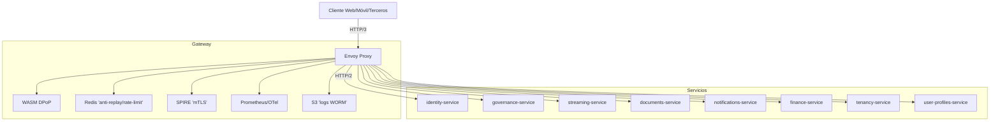

```mermaid
graph TD
    Client[Cliente Web/Móvil/Terceros]
    subgraph Gateway
      Envoy[Envoy Proxy]
      WASM[WASM DPoP]
      Redis[Redis 'anti-replay/rate-limit']
      SPIFFE[SPIRE 'mTLS']
      Prometheus[Prometheus/OTel]
      S3[S3 'logs WORM']
    end
    subgraph Servicios
      Identity[identity-service]
      Governance[governance-service]
      Streaming[streaming-service]
      Documents[documents-service]
      Notifications[notifications-service]
      Finance[finance-service]
      Tenancy[tenancy-service]
      UserProfiles[user-profiles-service]
    end
    Client -->|HTTP/3| Envoy
    Envoy --> WASM
    Envoy --> Redis
    Envoy --> SPIFFE
    Envoy --> Prometheus
    Envoy --> S3
    Envoy -->|HTTP/2| Identity
    Envoy --> Governance
    Envoy --> Streaming
    Envoy --> Documents
    Envoy --> Notifications
    Envoy --> Finance
    Envoy --> Tenancy
    Envoy --> UserProfiles
```
