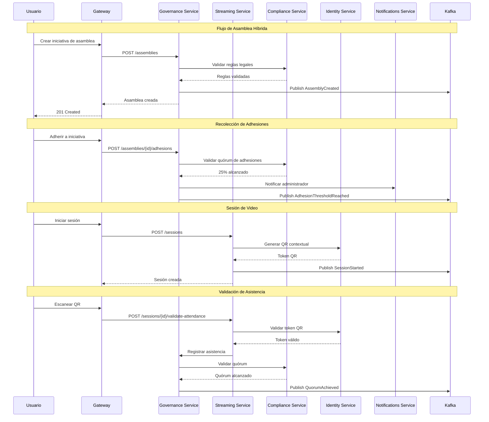
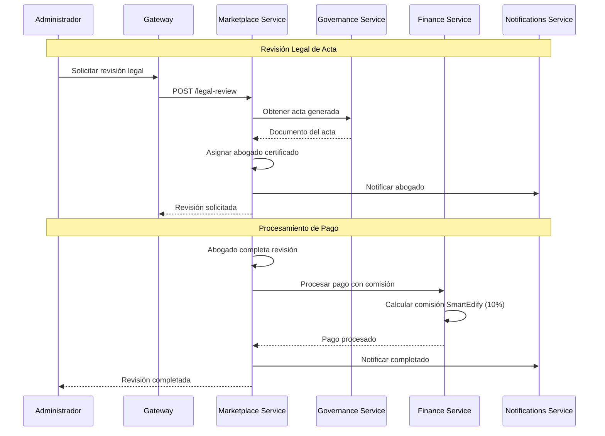

# Arquitectura de Servicios SmartEdify v2.0

## Diagrama General de Servicios

```mermaid
graph TB
    subgraph "Frontend Applications"
        WA[Web Admin<br/>:4000]
        WU[Web User<br/>:3000]
        MA[Mobile App<br/>:8081]
    end

    subgraph "BFF Layer"
        BFF_A[BFF Admin<br/>:4001]
        BFF_U[BFF User<br/>:3001]
        BFF_M[BFF Mobile<br/>:8082]
    end

    subgraph "API Gateway"
        GW[Gateway Service<br/>:8080]
    end

    subgraph "Core Services"
        IS[Identity Service<br/>:3001]
        UPS[User Profiles Service<br/>:3002]
        TS[Tenancy Service<br/>:3003]
        NS[Notifications Service<br/>:3005]
        DS[Documents Service<br/>:3006]
    end

    subgraph "Governance Services"
        GS[Governance Service<br/>:3011]
        CS[Compliance Service<br/>:3012]
        RS[Reservation Service<br/>:3013]
        SS[Streaming Service<br/>:3014]
    end

    subgraph "Operations Services"
        PSS[Physical Security Service<br/>:3004]
        FS[Finance Service<br/>:3007]
        PS[Payroll Service<br/>:3008]
        HCS[HR Compliance Service<br/>:3009]
        AMS[Asset Management Service<br/>:3010]
    end

    subgraph "Business Services"
        MS[Marketplace Service<br/>:3015]
        AS[Analytics Service<br/>:3016]
    end

    subgraph "Platform Services"
        subgraph "Observability"
            PROM[Prometheus<br/>:9090]
            GRAF[Grafana<br/>:3000]
            OTEL[OTel Collector<br/>:4317]
        end
        
        subgraph "Messaging"
            KAFKA[Apache Kafka<br/>:9092]
            REDIS[Redis<br/>:6379]
        end
        
        subgraph "Storage"
            PG[(PostgreSQL<br/>:5432)]
            S3[(S3 Storage)]
        end
    end

    %% Frontend to BFF connections
    WA --> BFF_A
    WU --> BFF_U
    MA --> BFF_M

    %% BFF to Gateway connections
    BFF_A --> GW
    BFF_U --> GW
    BFF_M --> GW

    %% Gateway to Services connections
    GW --> IS
    GW --> UPS
    GW --> TS
    GW --> NS
    GW --> DS
    GW --> GS
    GW --> CS
    GW --> RS
    GW --> SS
    GW --> PSS
    GW --> FS
    GW --> PS
    GW --> HCS
    GW --> AMS
    GW --> MS
    GW --> AS

    %% Service to Platform connections
    IS -.-> KAFKA
    GS -.-> KAFKA
    SS -.-> KAFKA
    FS -.-> KAFKA
    
    IS --> PG
    UPS --> PG
    TS --> PG
    GS --> PG
    FS --> PG
    
    DS --> S3
    SS --> S3
    
    IS --> REDIS
    GW --> REDIS
    
    %% Observability connections
    GW -.-> PROM
    IS -.-> OTEL
    GS -.-> OTEL
    SS -.-> OTEL

    classDef frontend fill:#e1f5fe,stroke:#01579b,color:#000
    classDef bff fill:#f3e5f5,stroke:#4a148c,color:#000
    classDef gateway fill:#e8f5e8,stroke:#1b5e20,color:#000
    classDef core fill:#fff3e0,stroke:#e65100,color:#000
    classDef governance fill:#fce4ec,stroke:#880e4f,color:#000
    classDef operations fill:#f1f8e9,stroke:#33691e,color:#000
    classDef business fill:#e0f2f1,stroke:#004d40,color:#000
    classDef platform fill:#f5f5f5,stroke:#424242,color:#000

    class WA,WU,MA frontend
    class BFF_A,BFF_U,BFF_M bff
    class GW gateway
    class IS,UPS,TS,NS,DS core
    class GS,CS,RS,SS governance
    class PSS,FS,PS,HCS,AMS operations
    class MS,AS business
    class PROM,GRAF,OTEL,KAFKA,REDIS,PG,S3 platform
```



## Flujo de Datos por Dominio

### Dominio de Gobernanza



### Dominio de Marketplace



## Patrones de Comunicación

### Síncrona (HTTP/REST)
- **Frontend ↔ BFF**: Autenticación, datos de UI
- **BFF ↔ Gateway**: Proxy con agregación
- **Gateway ↔ Services**: Operaciones CRUD, consultas

### Asíncrona (Eventos)
- **Governance Events**: Ciclo de vida de asambleas
- **Identity Events**: Cambios de usuario, tokens
- **Finance Events**: Pagos, cuotas, morosidad
- **Notification Events**: Envío de notificaciones

### Streaming (WebSocket)
- **Streaming Service**: Video en tiempo real
- **Governance Service**: Votación en vivo
- **Analytics Service**: Dashboards en tiempo real

## Patrones de Datos

### Multi-Tenant
```sql
-- Todos los servicios implementan RLS
CREATE POLICY tenant_isolation ON assemblies
    FOR ALL TO application_user
    USING (condominium_id = current_setting('app.current_tenant')::uuid);
```

### Event Sourcing (Governance)
```json
{
  "eventId": "uuid",
  "eventType": "VoteCast",
  "aggregateId": "assembly-uuid",
  "version": 1,
  "timestamp": "2025-09-30T20:00:00Z",
  "data": {
    "userId": "uuid",
    "vote": "in_favor",
    "aliquotWeight": 0.05
  }
}
```

### CQRS (Analytics)
- **Command Side**: Servicios operacionales
- **Query Side**: Analytics Service con data warehouse
- **Projection**: Vistas materializadas para dashboards