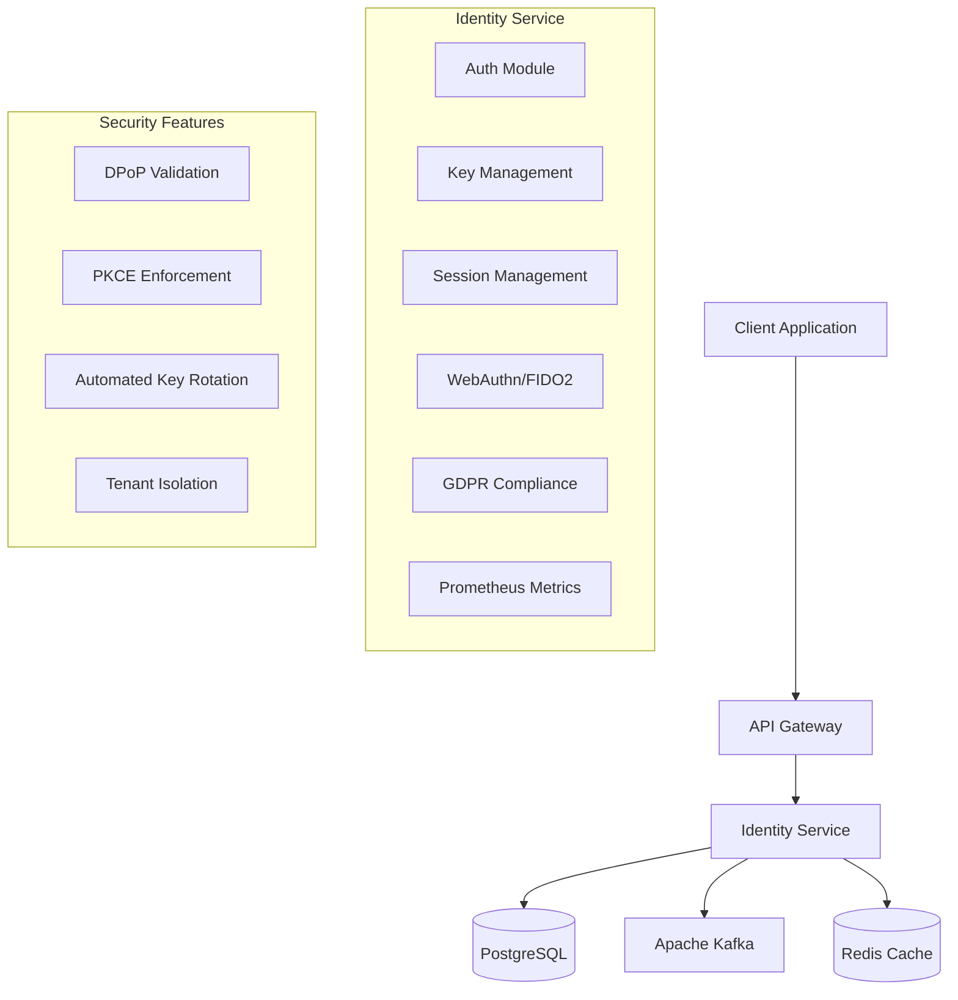
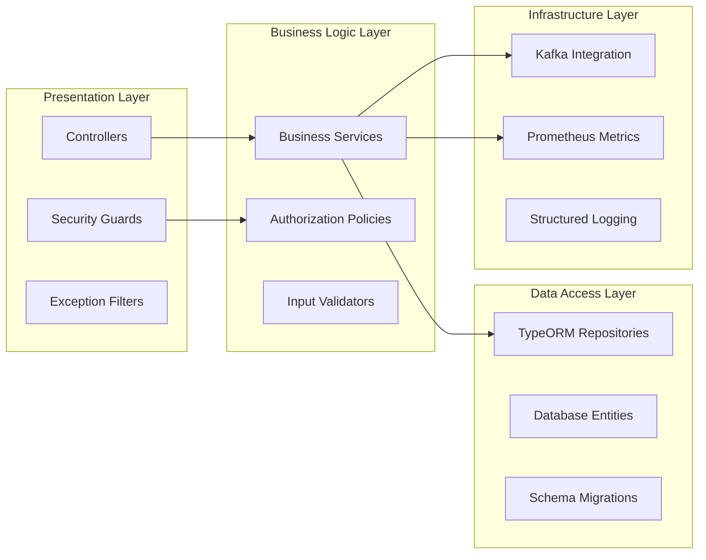
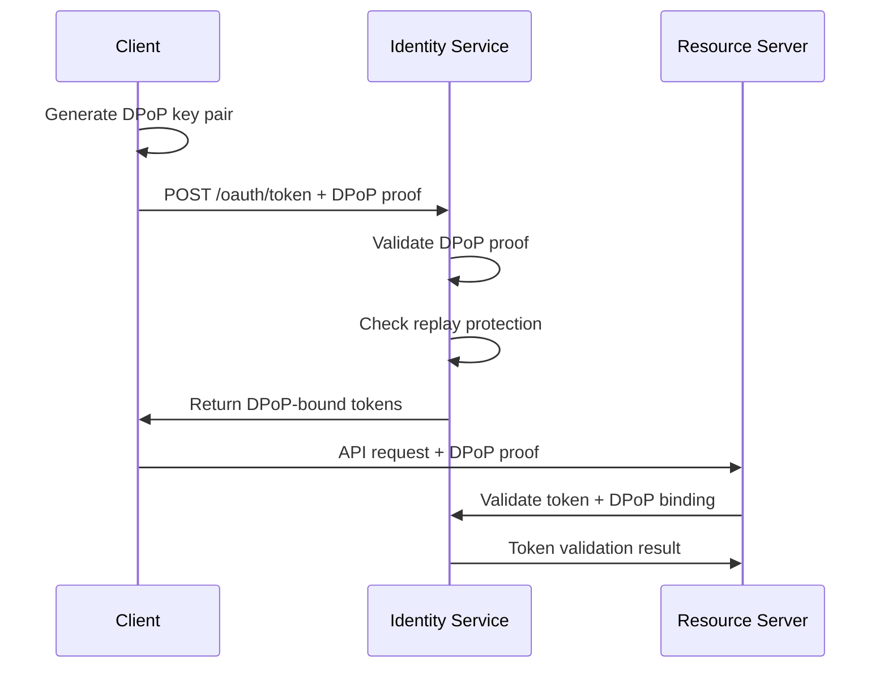
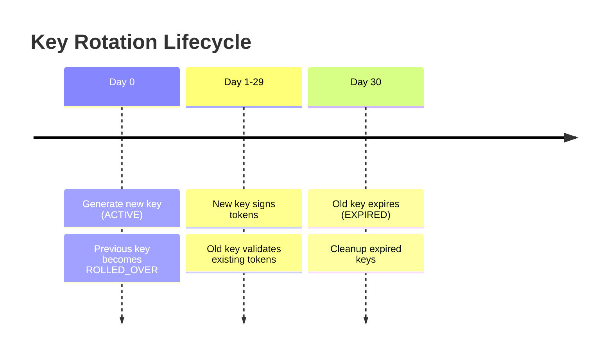
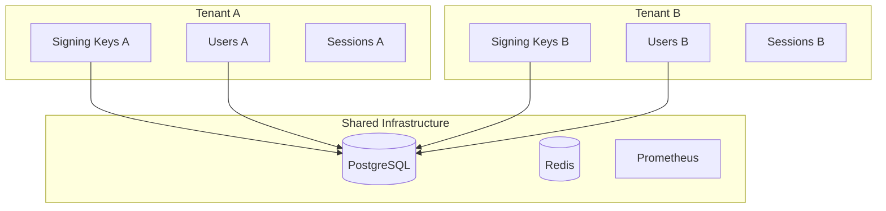
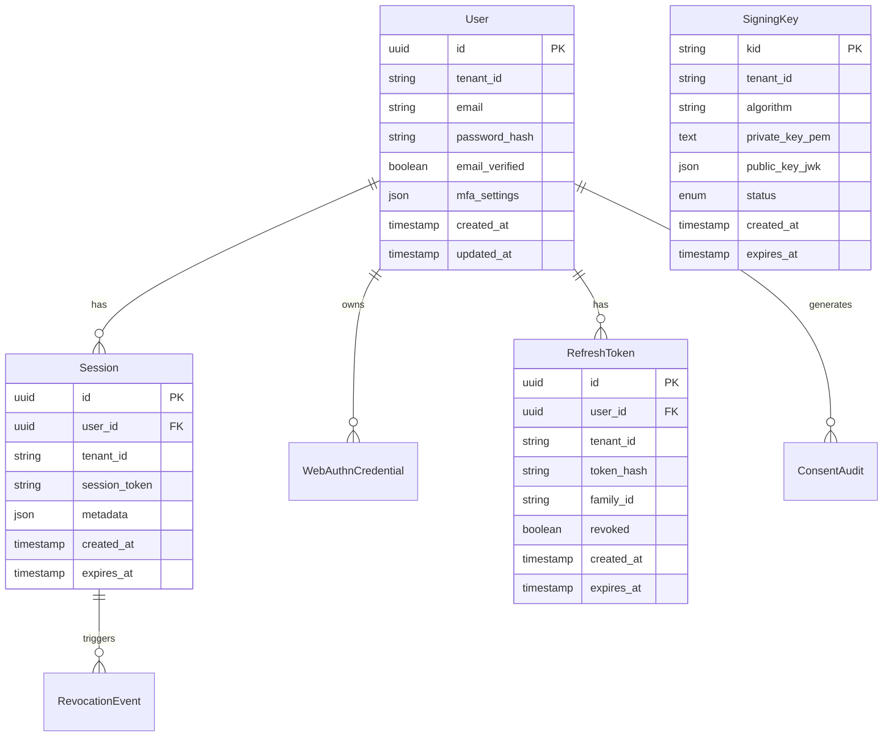
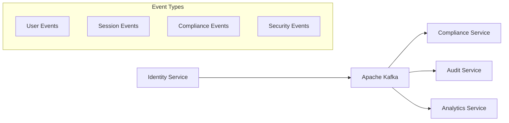
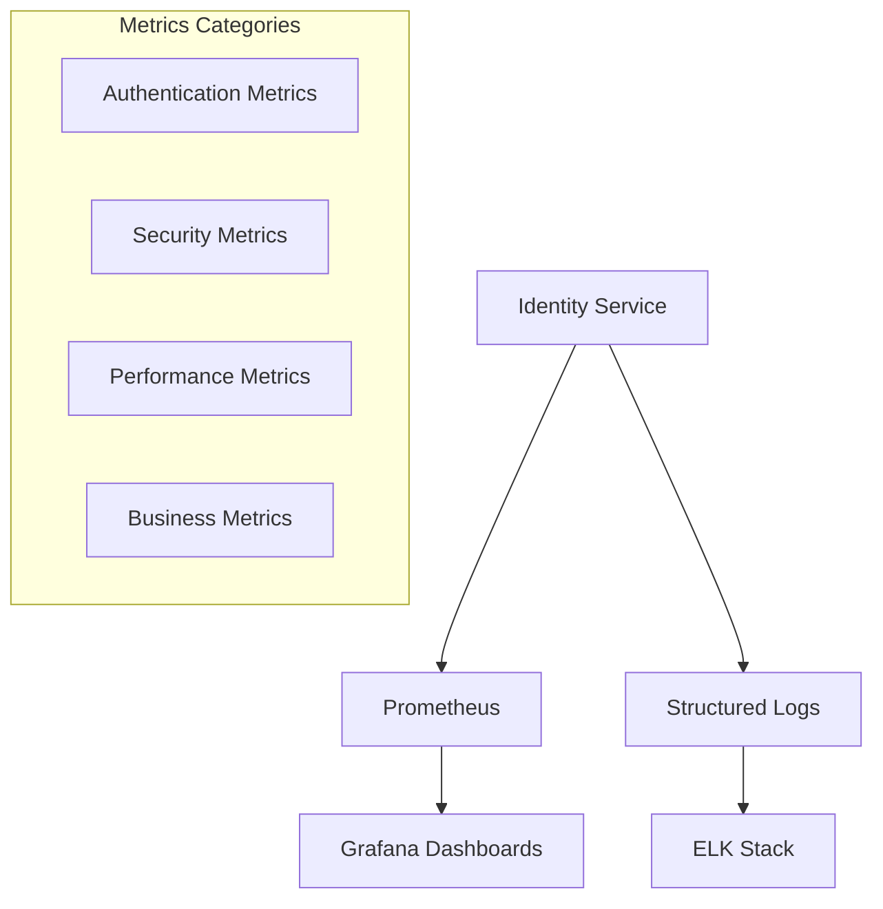

# Identity Service Architecture

## Overview

The SmartEdify Identity Service is an enterprise-grade OAuth 2.1/OIDC identity provider built with NestJS. It provides comprehensive authentication, authorization, and identity management capabilities with advanced security features including DPoP (Distributed Proof of Possession), automated key rotation, and multi-tenant isolation.

## System Architecture

### High-Level Architecture



### Component Architecture



## Core Modules

### Authentication Module (`/modules/auth`)

Implements OAuth 2.1 and OIDC specifications with advanced security features.

**Key Components:**
- `AuthController`: OAuth endpoints (authorize, token, revoke, introspect)
- `AuthService`: Core authentication logic
- `DpopGuard`: DPoP proof validation and replay protection
- `ClientAuthGuard`: OAuth client authentication

**Security Features:**
- PKCE mandatory for all flows
- DPoP proof of possession
- Pushed Authorization Requests (PAR)
- Device Authorization Flow
- Refresh token rotation with family tracking

### Key Management Module (`/modules/keys`)

Handles cryptographic key lifecycle with automated rotation and tenant isolation.

**Key Components:**
- `KeyManagementService`: Key generation, rotation, and retrieval
- `JwksController`: JWKS endpoint for public key distribution
- `SigningKey` Entity: Database model for key storage

**Features:**
- Daily automated key rotation
- ES256 and EdDSA algorithm support
- Tenant-specific key isolation
- Graceful key rollover (30-day overlap)

### Session Management Module (`/modules/sessions`)

Comprehensive session tracking and management with global logout coordination.

**Key Components:**
- `SessionsService`: Session lifecycle management
- `SessionGuard`: Session validation middleware
- `Session` Entity: Session data model
- `RevocationEvent` Entity: Logout event tracking

**Features:**
- Global session revocation
- Per-tenant session isolation
- Session audit trails
- Coordinated logout across services

### WebAuthn Module (`/modules/webauthn`)

FIDO2/WebAuthn implementation for passwordless authentication.

**Key Components:**
- `WebauthnController`: Registration and authentication endpoints
- `WebauthnService`: FIDO2 protocol implementation
- `ChallengeStoreService`: Challenge management
- `WebAuthnCredential` Entity: Credential storage

**Features:**
- Passkey registration and authentication
- Challenge-response validation
- Credential management
- Cross-platform compatibility

### Compliance Module (`/modules/compliance`)

GDPR compliance workflows with automated data processing.

**Key Components:**
- `ComplianceController`: DSAR endpoints
- `ComplianceService`: Data export/deletion workflows
- `ComplianceEventsProducer`: Kafka event publishing
- Job tracking and status management

**Features:**
- Data Subject Access Requests (DSAR)
- Right to be forgotten implementation
- Cross-service coordination via Kafka
- Audit trail maintenance

## Security Architecture

### DPoP (Distributed Proof of Possession)



**DPoP Implementation:**
- JWT-based proof of possession
- Replay attack prevention with JTI tracking
- Configurable time window validation
- Database or Redis-based replay detection

### Key Rotation Strategy



**Rotation Features:**
- Automated daily rotation via cron jobs
- Graceful transition with overlap period
- Tenant-specific rotation schedules
- Emergency rotation capabilities

### Multi-Tenant Security



**Isolation Features:**
- Cryptographic key separation
- Data access controls
- Session isolation
- Audit trail separation

## Data Architecture

### Database Schema



### Entity Relationships

**Core Entities:**
- `User`: User accounts with tenant isolation
- `Session`: Active user sessions with metadata
- `RefreshToken`: Refresh tokens with family tracking
- `SigningKey`: Cryptographic keys with rotation status
- `WebAuthnCredential`: FIDO2 credentials
- `DpopReplayProof`: Anti-replay protection records

**Audit Entities:**
- `ConsentAudit`: GDPR consent tracking
- `RevocationEvent`: Session termination events
- `ComplianceJob`: Data processing requests

## Integration Architecture

### Kafka Event Streaming



**Event Categories:**
- **User Events:** Registration, profile updates, deletions
- **Session Events:** Login, logout, session expiration
- **Compliance Events:** Data export/deletion requests
- **Security Events:** Authentication failures, key rotations

### Monitoring Integration



**Monitoring Capabilities:**
- Real-time authentication metrics
- Security event alerting
- Performance monitoring
- Business intelligence data

## Deployment Architecture

### Container Architecture

```dockerfile
# Multi-stage build for production
FROM node:18-alpine AS builder
WORKDIR /app
COPY package*.json ./
RUN npm ci --only=production

FROM node:18-alpine AS runtime
WORKDIR /app
COPY --from=builder /app/node_modules ./node_modules
COPY dist/ ./dist/
EXPOSE 3000
CMD ["node", "dist/main.js"]
```

### Environment Configuration

```yaml
# Production deployment configuration
apiVersion: apps/v1
kind: Deployment
metadata:
  name: identity-service
spec:
  replicas: 3
  selector:
    matchLabels:
      app: identity-service
  template:
    spec:
      containers:
      - name: identity-service
        image: identity-service:latest
        ports:
        - containerPort: 3000
        env:
        - name: DB_HOST
          valueFrom:
            secretKeyRef:
              name: database-secret
              key: host
        resources:
          requests:
            memory: "256Mi"
            cpu: "250m"
          limits:
            memory: "512Mi"
            cpu: "500m"
```

## Performance Considerations

### Scalability Patterns

1. **Horizontal Scaling:** Stateless service design enables horizontal scaling
2. **Database Optimization:** Indexed queries and connection pooling
3. **Caching Strategy:** Redis for session data and DPoP replay protection
4. **Load Balancing:** Session affinity not required due to stateless design

### Performance Optimizations

1. **Key Caching:** In-memory caching of active signing keys
2. **Connection Pooling:** Optimized database connection management
3. **Async Processing:** Non-blocking I/O for external service calls
4. **Batch Operations:** Bulk processing for compliance workflows

### Monitoring and Alerting

1. **Response Time Monitoring:** P95/P99 latency tracking
2. **Error Rate Alerting:** Automated alerts for high error rates
3. **Resource Utilization:** CPU, memory, and database monitoring
4. **Security Metrics:** Authentication failure rate monitoring

## Security Considerations

### Threat Model

1. **Token Theft:** Mitigated by DPoP binding and short token lifetimes
2. **Replay Attacks:** Prevented by DPoP JTI tracking and time windows
3. **Key Compromise:** Limited by automated rotation and tenant isolation
4. **Session Hijacking:** Prevented by secure session management

### Security Controls

1. **Input Validation:** Comprehensive validation using class-validator
2. **Output Encoding:** Proper encoding to prevent injection attacks
3. **Rate Limiting:** Protection against brute force attacks
4. **Audit Logging:** Complete audit trail for security events

### Compliance Requirements

1. **GDPR Compliance:** Data protection and privacy by design
2. **OAuth 2.1 Security:** Latest security recommendations implementation
3. **FIDO2 Certification:** WebAuthn specification compliance
4. **Industry Standards:** OWASP security guidelines adherence

This architecture provides a robust, secure, and scalable foundation for enterprise identity management while maintaining flexibility for future enhancements and integrations.