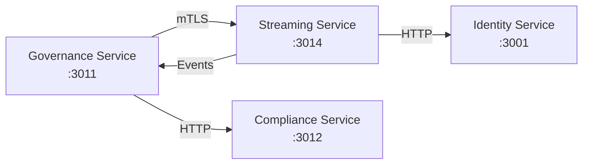

# SmartEdify Services

Microservicios de la plataforma SmartEdify organizados por dominio funcional.

## Estado de Implementación

### ✅ **Servicios Implementados**
- **governance-service** v3.2.2 (Puerto 3011) - ✅ Completo
- **streaming-service** v2.2.0 (Puerto 3014) - ✅ Completo

### ⚠️ **Servicios en Desarrollo**
- **asset-management-service** (Puerto 3010) - 🔄 Implementación parcial

### 📋 **Servicios Pendientes**
- **identity-service** (Puerto 3001) - Estructura básica
- **compliance-service** (Puerto 3012) - Crítico para governance
- **tenancy-service** (Puerto 3003) - Requerido por streaming
- Resto de servicios core y operacionales

## Estructura de Servicios por Capas

### 🏛️ **Governance Services** (`services/governance/`)
- **governance-service** ✅ - Orquestación de asambleas, votación, actas
- **streaming-service** ✅ - Video híbrido, validación asistencia, transcripción
- **compliance-service** ⚠️ - Motor normativo global, políticas
- **reservation-service** ⚠️ - Reservas de áreas comunes

### 🔐 **Core Services** (`services/core/`)
- **identity-service** ⚠️ - Autenticación, JWT, tokens contextuales
- **user-profiles-service** ⚠️ - Perfiles, roles por condominio  
- **tenancy-service** ⚠️ - Gestión condominios, límites
- **notifications-service** ⚠️ - Email, SMS, push, Event Schema Registry
- **documents-service** ⚠️ - Gestión documental, firma electrónica

### 🏢 **Operations Services** (`services/operations/`)
- **asset-management-service** 🔄 - Inventario, mantenimiento, proveedores
- **finance-service** ⚠️ - Cuotas, conciliación, PCGE/NIIF
- **physical-security-service** ⚠️ - CCTV, control accesos, IoT
- **payroll-service** ⚠️ - Nóminas, PLAME, beneficios
- **hr-compliance-service** ⚠️ - Ciclo empleado, SST, contratos

### 📊 **Business Services** (`services/business/`)
- **analytics-service** ⚠️ - BI, dashboards, ML predictivo
- **marketplace-service** ⚠️ - Ecosistema servicios premium

**Leyenda**: ✅ Completo | 🔄 En desarrollo | ⚠️ Pendiente

## Servicios por Puerto

### Core (3001-3006)
- `identity-service` (3001) - Gestión de identidad, JWT, RBAC/ABAC
- `user-profiles-service` (3002) - Perfiles de usuario, roles por condominio
- `tenancy-service` (3003) - Ciclo de vida de condominios, alícuotas
- `notifications-service` (3005) - Email, SMS, push, Event Schema Registry
- `documents-service` (3006) - Gestión documental, firma electrónica

### Governance (3011-3014)
- `governance-service` (3011) ✅ - Asambleas, votación, actas con IA
- `compliance-service` (3012) - Motor normativo global, validaciones
- `reservation-service` (3013) - Reservas de áreas comunes
- `streaming-service` (3014) ✅ - Video en vivo, QR, transcripción

### Operations (3004, 3007-3010)
- `physical-security-service` (3004) - CCTV, control accesos, IoT
- `finance-service` (3007) - Cuotas, conciliación, PCGE/NIIF
- `payroll-service` (3008) - Nóminas, PLAME, beneficios
- `hr-compliance-service` (3009) - Ciclo empleado, SST, contratos
- `asset-management-service` (3010) 🔄 - Inventario, mantenimiento, proveedores

### Business (3015-3016)
- `marketplace-service` (3015) - Ecosistema servicios premium
- `analytics-service` (3016) - BI, dashboards, ML predictivo

## Integraciones Implementadas

### ✅ **Governance ↔ Streaming**

**Endpoints Activos**:
- `POST /api/v1/sessions` (streaming) ← governance
- `POST /api/v1/sessions/{id}/end` (streaming) ← governance
- `POST /api/v1/assemblies/{id}/session-started` (governance) ← streaming
- `POST /api/v1/assemblies/{id}/session-ended` (governance) ← streaming

**Eventos Kafka**:
- `assembly.*.v1` - Governance → Streaming
- `session.*.v1` - Streaming → Governance
- `attendance.*.v1` - Streaming → Analytics

## Convenciones Clave

- **Un servicio = su propio Postgres, openapi/, db/migrations/, deployments/, tests/**
- **Eventos versionados**: todos los eventos se definen y versionan en `platform/events/` (AsyncAPI, Avro/JSON Schema)
- **BFF**: Termina PKCE y oculta refresh tokens. Las UIs consumen solo el BFF, nunca servicios directos
- **Tráfico**: `platform/mesh` gobierna tráfico este-oeste (servicio a servicio); Gateway solo norte-sur (cliente a backend)
- **ADR**: Toda decisión arquitectónica relevante se documenta en `doc/adr/`

## Buenas Prácticas

Cada servicio debe tener:
- `src/` para código fuente
- `openapi/` para contratos REST
- `db/migrations/` para migraciones de base de datos
- `deployments/` para manifiestos ECS/K8s
- `tests/` para unitarios, contract y e2e

### Seguridad
- JWT asimétrico (ES256/EdDSA), OIDC PKCE, RBAC/ABAC
- Cifrado TLS 1.3, auditoría inmutable
- Todos los tokens DEBEN incluir `kid` en el header
- Multi-tenancy con Row Level Security (RLS)

### Observabilidad
- Logs estructurados, métricas, trazas distribuidas (OpenTelemetry)
- >80% cobertura de pruebas, E2E para flujos críticos
- Health checks estandarizados (`/health`, `/health/ready`, `/health/live`)

## Documentación Técnica

- **Análisis de Compatibilidad**: [doc/SERVICES_COMPATIBILITY_ANALYSIS.md](../doc/SERVICES_COMPATIBILITY_ANALYSIS.md)
- **Arquitectura de Servicios**: [doc/SERVICES_ARCHITECTURE.md](../doc/SERVICES_ARCHITECTURE.md)
- **Políticas Globales**: [doc/POLICY_INDEX.md](../doc/POLICY_INDEX.md)

## Referencias

- Estructura de referencia: ver README global y SCOPE.md
- ADRs: `doc/adr/`
- Contratos: `contracts/openapi/`, `contracts/asyncapi/`
- Eventos: `platform/events/`
- Seguridad: `platform/security/`
- Observabilidad: `platform/observability/`

---

> Para cambios estructurales, breaking o nuevas integraciones, documentar en ADR y actualizar contratos antes de mergear a main.

Cada servicio es independiente, con su propia base de datos y ciclo de despliegue.