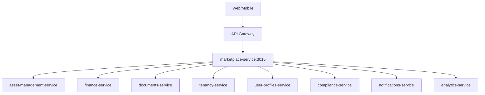

# marketplace-service

Servicio de **orquestación de marketplace** para proveedores certificados. Capa business. Puerto **3015**.

---

## 1) Propósito y alcance

* Catálogo de ofertas, órdenes de servicio (OS), ejecución y **informe de servicio**.
* Flujo financiero: el proveedor **cobranza directa** al cliente. SmartEdify registra **cuenta por cobrar** por el *take rate* y recibe **remesas** periódicas.
* Sin “asesoría en vivo”. Sin módulo de disputas. Se mide **calidad de servicio**.

**No-goals**

* Identidad, autorización L7, MFA, emisión/validación de tokens.
* Gestión de políticas globales, PKI, o gobierno cross-servicio.

---

## 2) Arquitectura

**Patrones**

* Microservicio REST + EDA. Contracts-first (OpenAPI/AsyncAPI). Outbox + DLQ.
* Idempotencia en *writes*. Compatibilidad backward de esquemas.

**Contexto (Mermaid)**



---

## 3) Dominio

**Entidades**

* `Provider`, `Offer`, `Order`, `WorkOrder` (OS), `ServiceReport`, `Settlement`, `Remittance`, `QualityMetric`.

**Estados clave**

* `Order`: `Placed → Accepted → InProgress → Completed → Closed|Cancelled`.
* `WorkOrder`: `Issued → Assigned → Executed → Reported → Approved`.
* `ServiceReport`: `Submitted → Reviewed → Approved|Rejected`.
* `Settlement`: `Created → Invoiced → RemittanceDue → Remitted → Reconciled|Overdue`.

---

## 4) API REST v1

Base path: `/api/v1/marketplace`.

### Recursos

* **Providers**: `GET /providers`, `POST /providers`
* **Offers**: `GET /offers`, `POST /offers`, `PATCH /offers/{id}`, `DELETE /offers/{id}`
* **Orders**: `POST /orders`, `GET /orders/{id}`, `PATCH /orders/{id}`
* **WorkOrders (OS)**: `POST /work-orders`, `GET /work-orders/{id}`, `PATCH /work-orders/{id}`
* **ServiceReports**: `POST /service-reports`, `GET /service-reports/{id}`
* **Settlements**: `GET /settlements`, `POST /settlements/{id}/invoice`, `POST /settlements/{id}/close`
* **Remittances**: `GET /remittances`, `POST /remittances/{id}/receive`, `POST /remittances/{id}/reconcile`
* **Quality**: `POST /quality-metrics`, `GET /quality-metrics?order_id=…`

### Reglas

* **Writes**: requieren DPoP y `Idempotency-Key` (TTL 24 h).
* **Límites**: documentar `429` y `413` por ruta.
* **PII**: minimizada por defecto.
* **Anexos**: subir evidencias a `documents-service` y referenciar por `document_id` + `sha256`.

---

## 5) Eventos (AsyncAPI)

Tópico base: `marketplace.v1.*`
Clave de partición: `{tenant_id}.{order_id}`

* Ofertas: `OfferCreated|OfferUpdated|OfferArchived`
* Órdenes: `OrderPlaced|OrderAccepted|OrderStarted|OrderCompleted|OrderCancelled`
* OS: `WorkOrderCreated|WorkOrderAssigned|WorkOrderExecuted`
* Informes: `ServiceReportSubmitted|ServiceReportApproved|ServiceReportRejected`
* Liquidación: `SettlementCreated|RemittanceDue|RemittanceReceived|ReconciliationCompleted|RemittanceOverdue`
* Calidad: `ServiceQualityRated|ServiceQualityKPIUpdated`

**Confiabilidad**

* Outbox transaccional. Reintentos con *exponential backoff + jitter*. DLQ por tópico.
* De-duplicación por `event_id` + `tenant_id`. Compatibilidad **backward** de esquemas.

---

## 6) Seguridad

* JWT JWS **ES256/EdDSA**. `kid` obligatorio. **HS256 prohibido**.
* JWKS *per tenant*. **TTL ≤ 300 s** y *negative caching* 60 s.
* DPoP obligatorio en *writes* y firma de *webhooks* salientes.
* Validación L7 en gateway. *Rate limits* y *quotas* por ruta.
* Mascaramiento de PII en respuestas y logs.
* Auditoría WORM para cambios de estado y conciliaciones.

---

## 7) Multitenancy y permisos

* Aislamiento por `tenant_id` con **RLS** en base de datos.
* Resolución de rol efectivo vía `tenancy-service` + `user-profiles-service`.
* **RBAC + ABAC**:

  * Roles: `tenant_admin`, `provider_admin`, `provider_agent`, `viewer`.
  * Atributos: `tenant_id`, `provider_id`, `ownership`, `certified`.
* Scopes REST:

  * `marketplace:providers.read|write`
  * `marketplace:offers.read|write`
  * `marketplace:orders.read|write`
  * `marketplace:reports.read|write`
  * `marketplace:settlements.read|write`
  * `marketplace:remittances.read|write`

---

## 8) Integraciones

* **Finance**: AR del *take rate* → `Settlement` → `Remittance` y conciliación.
* **Asset-Management**: alta y certificación de proveedores y servicios.
* **Documents**: almacenamiento de informes y evidencias firmadas.
* **Compliance**: políticas de acceso y retención.
* **Tenancy/User-Profiles**: contexto de tenant y roles efectivos.
* **Notifications**: estado de órdenes, OS, informes y remesas.
* **Analytics**: consumo de eventos para KPIs y tableros.

---

## 9) Gobierno de datos

* **Clasificación**: `PUBLIC|INTERNAL|SENSITIVE`. PII minimizada.
* **Retención**: `Order` 24m, `ServiceReport` 36m, `Settlement/Remittance` 60m.
* **Linaje**: registrar orígenes y transformaciones.
* **DSAR**: export por `order_id` y `tenant_id` con TTL.

---

## 10) Observabilidad

* **Métricas RED**: `http_requests_total`, `http_errors_total`, `http_request_duration_ms_bucket`.
* **Negocio**: `gmv_total`, `take_rate`, `orders_completed`, `remittance_cycle_time`, `overdue_ratio`, `service_quality_score`, `on_time_rate`, `first_time_fix_rate`.
* **Trazas**: OpenTelemetry con `order_id` y `tenant_id`.
* **Logs**: JSON con `correlation_id`.
* **Alertas**: seguridad, performance, conciliación vencida, caída de publicación/consumo.

---

## 11) SLO

* `GET /offers` P95 ≤ **200 ms**.
* `POST /orders` P95 ≤ **400 ms**.
* Disponibilidad ≥ **99.9%** mensual.
* Frescura de conciliación ≤ **24 h**.
* Error budget con alertas por consumo del 25/50/75/100%.

---

## 12) Operación

* **Despliegue**: IaC, *blue/green* o *canary*.
* **DB**: migraciones versionadas, *repeatable scripts*, particionado por `tenant_id`, índices compuestos.
* **Backups**: RPO ≤ 15 min, RTO ≤ 1 h.
* **Runbooks**: incidentes de conciliación, reenvío de eventos, *partial reconciliation*, reversos.
* **Cuotas**: límites por cliente y proveedor, *backpressure* en consumidores.

---

## 13) Seguridad de *webhooks* a proveedores

* Firma HMAC-based con `t` y `v1` en cabecera.
* Reintentos con backoff e idempotencia.
* Rotación de secretos y escáner de entrega.

---

## 14) Contratos

* **OpenAPI v1**

  * `contracts/openapi/marketplace-service.v1.yaml`
  * Ejemplos por estado (`OrderPlaced`, `OrderCompleted`, `ServiceReportApproved`).
* **AsyncAPI v1**

  * `contracts/asyncapi/marketplace-service.v1.yaml`
  * Esquemas versionados. Política **backward**.
* **Mocks**: Prism para REST. *Testcontainers* + Kafka para eventos.

---

## 15) Pruebas

* **Unitarias**: dominio y validaciones.
* **Contrato**: Dredd/Schemathesis para REST. Consumidor/productor en AsyncAPI.
* **E2E**: `Order → WorkOrder → ServiceReport → Settlement → Remittance`.
* **Datos sintéticos**: Faker/SDV con restricciones de negocio.
* **Chaos EDA**: duplicados, *out-of-order*, *poison pills*, DLQ.

---

## 16) Ejemplos

### Crear orden

```http
POST /api/v1/marketplace/orders
Idempotency-Key: 7d2c-...
Authorization: Bearer <JWT>
DPoP: <proof>

{
  "tenant_id": "t-001",
  "offer_id": "off-123",
  "provider_id": "prov-77",
  "requested_at": "2025-10-02T10:00:00Z"
}
```

### Evento de liquidación

```json
{
  "event_id": "evt-9ab",
  "type": "SettlementCreated",
  "occurred_at": "2025-10-02T12:00:00Z",
  "tenant_id": "t-001",
  "order_id": "ord-555",
  "provider_id": "prov-77",
  "amount_total": 120.00,
  "take_rate_percent": 12.5,
  "amount_due_smartedify": 15.00,
  "currency": "USD"
}
```

---

## 17) Checklist de *Definition of Done*

* OpenAPI/AsyncAPI v1 publicados con ejemplos válidos.
* RLS por `tenant_id` activa. Matriz de permisos y **scopes** por recurso.
* DPoP en *writes* y `Idempotency-Key` operativos.
* Outbox, DLQ y políticas de compatibilidad activas.
* SLO y tableros en producción. Runbooks y backups listos.
* Pruebas unitarias, contrato, E2E y chaos EDA pasando en CI.

---

## 18) Roadmap corto

* Escrow opcional por proveedor.
* Scorecard de calidad y certificación dinámica.
* Auto-remesas con conciliación continua y *exception handling*.
