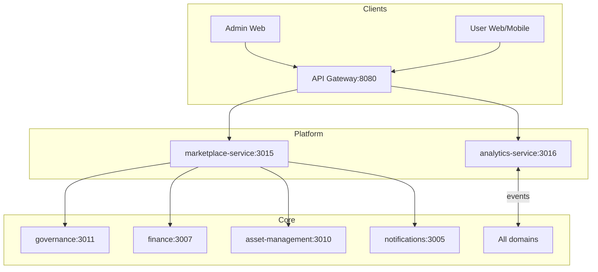

# Business Services
Plataforma de **servicios de negocio** que habilita ingresos premium y analítica avanzada sobre SmartEdify. Incluye `marketplace-service` (3015) y `analytics-service` (3016)

---

## 1) Visión

* **Marketplace:** orquesta un ecosistema de servicios premium para condominios: proveedores certificados, contratación, revisión legal y asesoría en vivo. 
* **Analytics:** provee BI, dashboards y modelos predictivos; consume eventos de todos los dominios.  

---

## 2) Alcance y límites

**Incluye**

* Marketplace: catálogo, ofertas, órdenes de servicio, conciliación de pagos, mensajería transaccional. 
* Analytics: ingestión de eventos, almacenamiento analítico, KPIs operativos, reporting y ML. 

**No-Goals**

* Identidad, emisión/validación de QR o MFA → `identity-service`. 
* Autorización L7, rate limits, DPoP anti-replay → `gateway`. 

---

## 3) Arquitectura

**Patrones**

* SRP por servicio, EDA con Kafka, CQRS en lecturas analíticas, *feature flags*. (alineado con patrones de línea 2/3) 
* Contracts-first (`contracts/openapi`, `contracts/asyncapi`). 

**Diagrama de contexto (Mermaid)**

**Integraciones clave**

* Marketplace ↔ Governance, Finance, Asset, Notifications. 
* Analytics consume eventos de todos los servicios, incl. Governance/Finance/Asset. 
* Reservation emite eventos hacia Analytics como productor de línea 2. 

---

## 4) Seguridad

**Baseline transversal**

* JWT JWS **ES256/EdDSA**, `kid` obligatorio; **HS256 prohibido**. 
* PKCE obligatorio en OIDC; validación L7 en gateway. 
* DPoP en *writes* y en WebSocket handshake; anti-replay con TTL. 
* JWKS cache TTL ≤ 300 s, *negative caching* 60 s. 

**Privacidad y cumplimiento**

* DSAR y auditoría WORM delegadas a servicios de núcleo; Analytics evita PII en métricas agregadas. (alineado con lineamientos de plataforma) 

---

## 5) Marketplace-service (3015)

**Dominio**

* Casos: revisión legal de actas, asesoría en vivo, mantenimiento especializado, seguros grupales. 
* Modelo de ingresos: comisión 5–15%, suscripción premium, certificación de proveedores. 

**Contratos**

* REST `v1` según `contracts/openapi/marketplace-service.v1.yaml`. 
* Eventos: `OfferCreated`, `OrderPlaced`, `OrderSettled` en `contracts/asyncapi/`. 

**Dependencias**

* `governance-service` para asesoría y revisión de actas. 
* `finance-service` para órdenes y liquidaciones. 
* `asset-management-service` para proveedores técnicos. 
* `notifications-service` para alertas y estado. 

**Operación**

* Autenticación vía gateway; DPoP requerido en mutaciones. 
* Errores RFC-7807 coherentes con gateway. 

---

## 6) Analytics-service (3016)

**Dominio**

* Dashboards, reportes ad-hoc, modelos ML, data warehouse. 
* Casos: predicción de quórum, morosidad, optimización de gastos, satisfacción. 

**Ingesta y fuentes**

* Consumidor universal de eventos de dominio. 
* Ejemplo de productor: `reservation-service` → `analytics-service`. 

**Contratos**

* Esquemas en `contracts/asyncapi/`; políticas de retención y minimización aplican.  

**Seguridad**

* Acceso solo lectura para *dashboards* por rol; JWT ES256/EdDSA y PKCE a través de BFF. 

---

## 7) KPIs y métricas

* Marketplace: GMV, *take rate*, NPS proveedor, *repeat purchase*. 
* Analytics: adopción, *engagement* de dashboards, precisión de modelos, ahorros. 

---

## 8) Observabilidad

* Prometheus `/metrics`, trazas OTel, logs JSON con *correlation IDs*. 
* Alertas: seguridad, performance y operación. 

---

## 9) Desarrollo

**Stack**

* Node.js + TypeScript, PostgreSQL, Kafka; OpenAPI/AsyncAPI. 

**Flujo**

* Contracts-first → codegen → implementación → validación. 
* Estándares: TS strict, ESLint, Prettier, hooks. 

---

## 10) Despliegue

* Requisitos: Node 18+, Docker, PostgreSQL 13+, Kafka. 
* Gateway con JWKS TTL ≤300s, DPoP y PKCE pre-filtro.  

---

## 11) Checklist (DoD)

* OpenAPI/AsyncAPI publicados en `contracts/`. 
* Autenticación: JWT ES256/EdDSA con `kid`; PKCE y DPoP verificados end-to-end.  
* Observabilidad activa y tableros RED. 
* Pruebas E2E de flujos principales por servicio. 

---

## 12) Roadmap corto

* Marketplace: flujo de certificación y *scorecard* de proveedores, SLA de liquidación. 
* Analytics: nuevos modelos para quórum y morosidad, *self-service* de reportes. 

---

## 13) Licencia y soporte

Software propietario. Ver guía de *support* y referencia en OpenAPI/AsyncAPI. 

---
