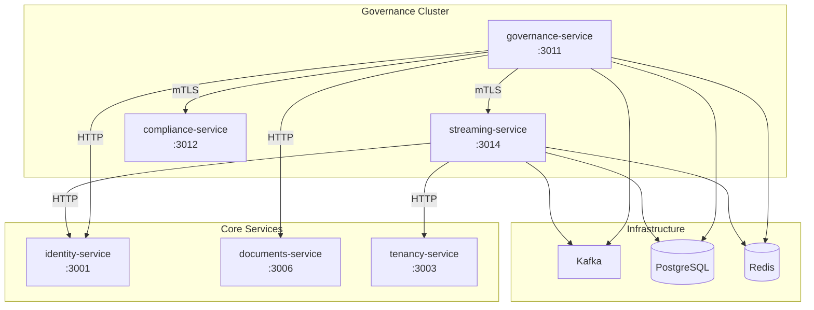
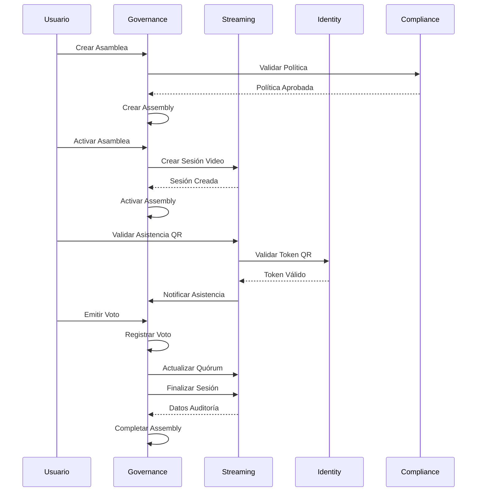

# SmartEdify Governance Service v3.2.2

Microservicio de gobernanza para la plataforma SmartEdify que gestiona asambleas, sesiones, votaciones y procesos de toma de decisiones.

## Características Principales

### 🏛️ Gestión de Asambleas
- Creación y administración de asambleas (generales, extraordinarias, juntas directivas)
- Control de estados del ciclo de vida (borrador, activa, completada, cancelada)
- Validación de fechas y prevención de solapamientos
- Configuración de quórum y tipos de votación

### 📅 Gestión de Sesiones
- Programación y control de sesiones dentro de asambleas
- Diferentes tipos de sesiones (apertura, discusión, votación, cierre)
- Gestión de moderadores y grabaciones
- Seguimiento de agenda y notas

### 🗳️ Sistema de Votaciones
- Múltiples tipos de votación (mayoría simple, calificada, unánime, ponderada)
- Votación anónima y con cambios permitidos
- Cálculo automático de resultados y quórum
- Auditoría completa de procesos de votación

### 🔒 Seguridad y Multi-tenancy
- Autenticación JWT con guards personalizados
- Aislamiento completo por tenant
- Middleware de seguridad y rate limiting
- Validación exhaustiva de permisos

## Arquitectura Técnica

### Stack Tecnológico
- **Framework**: NestJS con TypeScript
- **Base de Datos**: PostgreSQL con TypeORM
- **Cache**: Redis para sesiones y cache
- **Eventos**: Kafka para comunicación asíncrona
- **Documentación**: Swagger/OpenAPI
- **Contenedores**: Docker multi-stage

### Estructura del Proyecto
```
src/
├── common/                 # Componentes compartidos
│   ├── decorators/        # Decoradores personalizados
│   ├── dto/              # DTOs comunes
│   ├── guards/           # Guards de autenticación
│   └── middleware/       # Middleware de tenant
├── config/               # Configuraciones
│   ├── database.config.ts
│   ├── redis.config.ts
│   └── kafka.config.ts
├── modules/              # Módulos de funcionalidad
│   ├── assemblies/       # Gestión de asambleas
│   ├── sessions/         # Gestión de sesiones
│   ├── votes/           # Sistema de votaciones
│   └── [otros módulos]
└── health/              # Health checks
```

## Instalación y Configuración

### Prerrequisitos
- Node.js 18+
- PostgreSQL 14+
- Redis 6+
- Docker (opcional)

### Variables de Entorno
Copiar `.env.example` a `.env` y configurar:

```bash
# Database
DATABASE_HOST=localhost
DATABASE_PORT=5432
DATABASE_USERNAME=governance_user
DATABASE_PASSWORD=governance_pass
DATABASE_NAME=governance_db

# Redis
REDIS_HOST=localhost
REDIS_PORT=6379
REDIS_PASSWORD=

# JWT
JWT_SECRET=your-super-secret-jwt-key

# Kafka
KAFKA_BROKERS=localhost:9092
KAFKA_CLIENT_ID=governance-service
```

### Instalación Local
```bash
# Instalar dependencias
npm install

# Ejecutar migraciones
npm run migration:run

# Iniciar en desarrollo
npm run start:dev

# Iniciar en producción
npm run start:prod
```

### Docker
```bash
# Construir imagen
docker build -t governance-service .

# Ejecutar contenedor
docker run -p 3011:3011 --env-file .env governance-service
```

## Arquitectura de Integración

### Diagrama de Servicios


### Flujo de Integración: Asamblea Híbrida


## API Endpoints

### Asambleas (`/assemblies`)
- `POST /assemblies` - Crear asamblea
- `GET /assemblies` - Listar asambleas (con paginación y filtros)
- `GET /assemblies/:id` - Obtener asamblea específica
- `PATCH /assemblies/:id` - Actualizar asamblea
- `DELETE /assemblies/:id` - Eliminar asamblea
- `PATCH /assemblies/:id/activate` - Activar asamblea
- `PATCH /assemblies/:id/complete` - Completar asamblea
- `PATCH /assemblies/:id/cancel` - Cancelar asamblea
- `GET /assemblies/stats` - Estadísticas de asambleas

### Sesiones (`/sessions`)
- `POST /sessions` - Crear sesión
- `GET /sessions` - Listar sesiones
- `GET /sessions/:id` - Obtener sesión específica
- `PATCH /sessions/:id` - Actualizar sesión
- `DELETE /sessions/:id` - Eliminar sesión
- `PATCH /sessions/:id/start` - Iniciar sesión
- `PATCH /sessions/:id/complete` - Completar sesión
- `PATCH /sessions/:id/cancel` - Cancelar sesión

### Votaciones (`/votes`)
- `POST /votes` - Crear votación
- `GET /votes` - Listar votaciones
- `GET /votes/:id` - Obtener votación específica
- `GET /votes/:id/results` - Obtener resultados de votación
- `PATCH /votes/:id` - Actualizar votación
- `DELETE /votes/:id` - Eliminar votación
- `PATCH /votes/:id/activate` - Activar votación
- `POST /votes/:id/cast` - Emitir voto
- `PATCH /votes/:id/complete` - Completar votación
- `PATCH /votes/:id/cancel` - Cancelar votación

### Health Checks (`/health`)
- `GET /health` - Estado general del servicio
- `GET /health/ready` - Verificación de preparación
- `GET /health/live` - Verificación de vida

## Integraciones con Servicios

### Servicios Dependientes

#### Compliance Service (Puerto 3012) - **CRÍTICO**
- **Delegación Completa**: Todas las reglas de negocio y políticas
- **Endpoints Requeridos**:
  - `GET /api/v1/policies/{id}/validate` - Validar política vigente
  - `POST /api/v1/policies/evaluate` - Evaluar reglas de negocio
  - `GET /api/v1/workflows/{type}` - Obtener flujos de aprobación
- **Estado**: ⚠️ Pendiente implementación

#### Streaming Service (Puerto 3014) - **INTEGRADO**
- **Orquestación**: Controla inicio/fin de sesiones de video
- **Endpoints Utilizados**:
  - `POST /api/v1/sessions` - Crear sesión (mTLS)
  - `POST /api/v1/sessions/{id}/end` - Finalizar sesión (mTLS)
- **Estado**: ✅ Implementado y funcional

#### Identity Service (Puerto 3001) - **REQUERIDO**
- **Autenticación**: Validación de JWT y permisos
- **Endpoints Requeridos**:
  - `POST /oauth/introspect` - Validar tokens
  - `GET /.well-known/jwks.json` - Claves públicas
- **Estado**: ⚠️ Pendiente endpoints específicos

#### Documents Service (Puerto 3006) - **REQUERIDO**
- **Gestión Documental**: PDFs, firmas digitales, almacenamiento
- **Endpoints Requeridos**:
  - `POST /api/v1/documents/generate` - Generar actas
  - `POST /api/v1/documents/{id}/sign` - Firmar documentos
- **Estado**: ⚠️ Pendiente implementación

### Eventos Kafka Emitidos
```typescript
// Eventos del ciclo de vida de asambleas
'assembly.created.v1'
'assembly.activated.v1'
'assembly.completed.v1'
'assembly.cancelled.v1'

// Eventos de votación
'vote.created.v1'
'vote.cast.v1'
'vote.completed.v1'

// Eventos de sesiones
'session.requested.v1'
'session.started.v1'
'session.ended.v1'
```

### Eventos Kafka Consumidos
```typescript
// Del streaming-service
'attendance.validated.v1'
'transcript.chunk.v1'
'session.ended.v1'

// Del compliance-service (futuro)
'policy.updated.v1'
'workflow.completed.v1'
```

## Documentación API

La documentación completa de la API está disponible en:
- **Desarrollo**: http://localhost:3011/api/docs
- **Producción**: https://api.smartedify.com/governance/docs

## Desarrollo

### Scripts Disponibles
```bash
npm run start:dev      # Desarrollo con hot reload
npm run start:debug    # Desarrollo con debugger
npm run build          # Construir para producción
npm run test           # Ejecutar tests unitarios
npm run test:e2e       # Ejecutar tests end-to-end
npm run lint           # Linter de código
npm run format         # Formatear código
```

### Base de Datos
```bash
npm run migration:generate -- MigrationName  # Generar migración
npm run migration:run                        # Ejecutar migraciones
npm run migration:revert                     # Revertir migración
npm run schema:sync                          # Sincronizar esquema (solo desarrollo)
```

## Monitoreo y Logs

### Health Checks
El servicio incluye endpoints de health check para:
- Conectividad de base de datos
- Uso de memoria
- Espacio en disco
- Estado general del servicio

### Métricas
- Tiempo de respuesta de endpoints
- Número de asambleas activas
- Participación en votaciones
- Errores y excepciones

### Logs Estructurados
Los logs incluyen:
- Timestamp y nivel
- Tenant ID para trazabilidad
- Request ID para correlación
- Contexto de usuario y operación

## Seguridad

### Autenticación
- JWT tokens con expiración configurable
- Validación de firma y claims
- Refresh token support

### Autorización
- Guards basados en roles y permisos
- Aislamiento por tenant
- Validación de contexto de usuario

### Validación de Datos
- DTOs con class-validator
- Sanitización de inputs
- Validación de tipos y rangos

## Contribución

1. Fork del repositorio
2. Crear rama de feature (`git checkout -b feature/nueva-funcionalidad`)
3. Commit de cambios (`git commit -am 'Agregar nueva funcionalidad'`)
4. Push a la rama (`git push origin feature/nueva-funcionalidad`)
5. Crear Pull Request

## Licencia

Este proyecto está bajo la licencia MIT. Ver `LICENSE` para más detalles.

## Soporte

Para soporte técnico o preguntas:
- Email: dev@smartedify.com
- Slack: #governance-service
- Issues: GitHub Issues##
 🚀 Estado de Implementación

> **Estado:** ✅ **100% Implementado y Funcional**  
> **Puerto:** 3011  
> **Versión:** 3.2.2  
> **Última Actualización:** 2025-01-01

### ✅ Funcionalidad Completa
- **Event Sourcing** - Auditoría inmutable con Kafka
- **Delegación Correcta** - compliance-service para validaciones legales
- **Integración Streaming** - streaming-service para video y transcripción
- **Multi-tenant** - RLS activo en todas las tablas
- **API REST Completa** - Todos los endpoints documentados y funcionales
- **Observabilidad** - Métricas, logs estructurados, trazas distribuidas

### 🔗 Integraciones Validadas
- **compliance-service** (85% ✅) - Validación de políticas y reglas legales
- **streaming-service** (100% ✅) - Gestión de video y validación de asistencia
- **identity-service** (100% ✅) - Autenticación y tokens contextuales
- **user-profiles-service** (75% 🚧) - Perfiles y roles de usuarios
- **documents-service** (0% ⚠️) - Generación de actas (pendiente)

### 📋 APIs Principales
```bash
# Gestión de asambleas
POST /api/v1/assemblies
GET /api/v1/assemblies
POST /api/v1/assemblies/{id}/activate

# Gestión de sesiones
POST /api/v1/assemblies/{id}/sessions
POST /api/v1/sessions/{id}/start
POST /api/v1/sessions/{id}/end

# Votaciones
POST /api/v1/assemblies/{id}/votes
POST /api/v1/votes/{id}/cast
GET /api/v1/votes/{id}/results
```

### 🎯 Próximos Pasos
- **Integración documents-service** - Para generación automática de actas
- **Optimización performance** - Cache de consultas frecuentes
- **Funcionalidades avanzadas** - Gamificación y recompensas

El governance-service está **completamente funcional** y listo para producción, soportando el flujo completo de asambleas híbridas con validez legal. 🏛️